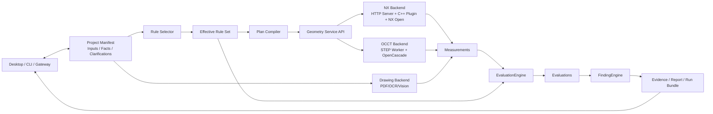

# DFM Hermes Agent 产品目标与研发路线图

本文档只回答四个长期问题：项目要解决什么问题、产品边界是什么、由哪些功能模块组成、
按什么阶段交付和验收。具体接口、代码步骤、测试记录和团队分工由专项文档承接，不在
roadmap 中重复维护。

当前状态：M0–M2.5 已完成，正在推进 **M2.6 NX 黄金产品 DFM 纵向闭环**；M3 图纸文本
理解可并行准备。

## 1. 项目目标

### 1.1 产品目标

建设一个基于 Hermes 的多工艺 DFM 分析智能体。用户提交产品三维模型、2D 工程图纸或
两者组合后，智能体能够：

1. 建立可恢复的 DFM 项目并管理输入版本；
2. 识别制造工艺、材料、单位、出模方向等项目事实；
3. 对缺失或冲突的关键事实向用户发起少量、明确的澄清；
4. 根据项目事实和版本化规则选择当前产品需要计算的指标；
5. 调用经过认证的几何、OCR 或仿真 Backend 产生客观 Measurement；
6. 用确定性规则完成 Evaluation 和 Finding；
7. 输出包含数值、规则、区域、证据、版本和建议的可复核报告；
8. 支持取消、失败恢复、输入升级和受影响分析项重跑。

智能体负责理解、澄清、规划、编排和解释；工程 Backend 负责客观计算；规则引擎负责
确定性评价。LLM 不直接生成壁厚、拔模角、孔隙率、阈值或风险分数。

### 1.2 用户使用闭环

```text
创建/恢复项目
→ 上传产品模型和/或图纸
→ 识别工艺与输入能力
→ 提取事实并请求必要澄清
→ 选择有效规则和所需指标
→ 生成并确认分析计划
→ 调用认证 Backend 计算
→ Evaluation / Finding / Evidence
→ 查看报告、补充资料或重跑
```

完成态不是“Agent 给出了一段看起来合理的回答”，而是每个工程结论都能追溯到：

```text
Input → Confirmed Fact → Effective Rule → Plan Task
→ Calculator/Backend → Measurement → Evaluation → Finding → Evidence
```

### 1.3 成功标准

项目最终应满足：

- **业务可用**：代表性产品的分析结果达到模具工程师批准的误差、召回和证据要求；
- **结果可信**：定量 Finding 必须同时引用 Measurement 和版本化 Rule；
- **多工艺隔离**：注塑与压铸使用独立事实要求、规则范围和能力声明；
- **多 Backend 一致**：NX 与 OCCT 遵循同一 Measurement 契约，不在 Backend 内评价工艺规则；
- **可恢复**：项目、计划、运行和制品不依赖聊天记录，可从 Manifest 恢复；
- **可扩展**：新增格式、工艺、Calculator 或 OCR Provider 不需要修改 Hermes Agent Loop；
- **不破坏 Hermes**：DFM 是默认关闭的独立 toolset，不扩大无关会话的工具 Schema，保持
  会话内提示词和工具 Schema 稳定；
- **可回归**：新增压铸、NX 或图纸能力不改变已批准的注塑 STEP 结果。

## 2. 产品范围与能力边界

### 2.1 工艺范围

| 工艺 | 当前定位 | 近期目标 |
| --- | --- | --- |
| 注塑 `injection` | 已交付 STEP 生产基线 | 保持行为兼容，逐步迁移到统一 Rule/Plan/Evaluation 架构 |
| 压铸 `die_casting` | 已有工艺适配和 STEP 拓扑冒烟 | 通过 `.x_t` 黄金产品打通 NX Server、插件、规则和报告闭环 |
| 其他工艺 | 不在当前承诺范围 | 复用 ProcessAdapter 和规则范围逐项评估，不共享阈值冒充支持 |

### 2.2 输入与能力矩阵

| 输入 | 当前能力 | 目标能力 | 明确限制 |
| --- | --- | --- | --- |
| STEP/STP 产品模型 | 注塑完整链路；压铸拓扑检查 | 继续由 OCCT Backend 提供认证 Calculator | 不能可靠提供材料、工艺、图纸公差和客户要求 |
| Parasolid `.x_t` 产品模型 | 轻量预检和 HTTP NX Client 契约已具备；真实分析未交付 | NX Server + NX C++ Plugin 产生 Measurement | 本地不解析 B-Rep；NX 服务、许可证、格式版本和 Calculator 未认证时必须阻塞 |
| PDF/PNG/JPG 2D 图纸 | 尚未实现生产提取 | OCR、版面、字段和工程特征识别 | 无可靠比例或明确尺寸时不得从像素推断精确几何值 |
| 三维模型 + 2D 图纸 | 尚未实现融合 | 图纸要求与几何测量交叉校验、局部规则应用 | 二维区域映射到三维拓扑有歧义时必须请求确认 |
| 模流/凝固仿真结果 | 尚无 Backend | 后续通过 Simulation Result Backend 或标准结果导入器接入 | 空气压力、卷气、温度、热节和孔隙率不能由单个产品 B-Rep 推导 |

### 2.3 当前不做

- 不建设通用 CAD 查看、编辑、建模或格式转换平台；
- 不自动修改客户产品模型；
- M2.6 不分析完整模具装配、冷却水路或全部模具结构；
- 不把工程师 Ground Truth 发送给 Agent 或写入生产分析；
- 不开发 Ground Truth 自动比较程序，第 21 步由模具工程师人工核对；
- 不为 DFM 重写第二套 Desktop 聊天、附件或会话系统；
- 不在工具调用中自动安装 NX、OpenCascade、OCR 等重型依赖；
- 不把未认证能力、占位结果或 LLM 推断包装成正式 Finding。

## 3. 总体架构与主流程



### 3.1 架构职责

```text
Project Facts
→ 决定哪些规则适用
→ Effective Rule Set 描述当前产品需要哪些指标
→ Plan Compiler 把指标解析为 Calculator DAG
→ Geometry/Document Backend 只输出 Measurement
→ EvaluationEngine 用规则参数评价 Measurement
→ FindingEngine 形成工程问题、区域、证据和建议
```

### 3.2 必须保持的架构原则

1. **Manifest 是项目事实来源。** 聊天和 memory 只服务对话连续性，不替代项目数据库。
2. **Measurement 与 Evaluation 分离。** NX、OCCT、OCR 或仿真 Backend 不输出最终工艺判断。
3. **规则驱动计划。** 当前产品计算哪些指标由事实和 Effective Rule Set 决定，不由 LLM
   临时选择一组脚本，也不默认运行所有 Calculator。
4. **能力必须认证。** 格式可读取不等于 Calculator 可用；Plan 只能使用 Backend 声明为
   `certified` 的 Calculator。
5. **结果必须可追溯。** Run 固化输入哈希、事实、规则、Plan、Backend、Calculator 和制品版本。
6. **缺失条件显式阻塞。** 使用结构化 `dependency_missing`、`unsupported_capability`、
   `rule_not_found` 等状态，不补假值。
7. **扩展留在边缘。** DFM 使用独立、默认关闭的 toolset；不修改 Hermes Agent Loop，
   不加入 `_HERMES_CORE_TOOLS`。
8. **用户事实与规则分离。** 材料、单位、出模方向属于项目事实；阈值、适用条件和严重程度
   属于版本化规则库。

## 4. 功能模块

| 模块 | 核心职责 | 当前状态 | 下一交付 |
| --- | --- | --- | --- |
| Hermes 接入与对话协调 | `dfm_project`/`dfm_analysis` 工具适配；理解新建、继续、确认、运行和取结果 | 已完成基础闭环 | 保持工具 Schema 稳定，优化当前里程碑用户流程 |
| Project/Manifest | 管理项目、输入版本、Facts、Clarifications、Plans、Runs 和 Artifacts | 已完成 | 支持黄金产品事实和 Run Bundle 完整追溯 |
| Intake/Preflight | 识别 STEP、`.x_t`、图纸输入，完成哈希、安全预检和能力查询 | STEP 可用，`.x_t` 轻量预检完成 | 对接真实 NX 上传和格式/许可证状态 |
| ProcessAdapter | 隔离注塑/压铸的 required facts、scope 和 capability | 注塑、压铸已拆分 | 完善压铸黄金产品所需事实和规则范围 |
| Clarification/Fact | 提出缺失事实问题并将用户确认写回 Manifest | 基础能力已完成 | 冻结合金、单位、六个出模方向、区域和工艺参数 |
| Rule Repository/Selector | 管理版本化规则，根据工艺、材料、特征和区域形成 Effective Rule Set | 当前有版本化 scope/规则文件，通用管理能力未完成 | M2.6 建立最小压铸规则；M5/M6 完成选择、审核、发布和后台管理边界 |
| Plan Compiler | 把 required metrics 转换为依赖有序的 Calculator DAG 和 Backend 要求 | 已有 Plan 门控和操作白名单 | 迁移为稳定、格式无关的 Calculator ID，并解析 NX capability |
| Geometry Service | 统一格式、Calculator、Backend 和 certification resolution | 目标边界已确定，正式服务待收敛 | M2.6 贯通 NX；M5 形成 NX/OCCT 统一注册与解析接口 |
| OCCT Backend | STEP B-Rep 读取、几何 Measurement 和证据 | 注塑生产基线及压铸拓扑冒烟已完成 | 继续回归，按价值迁移可复用 Calculator |
| NX Backend | `.x_t` 上传、Job、NX Open、C++ Calculator、Measurement 和 Evidence | HTTP Client/契约完成；Server/插件未交付 | 完成黄金产品所需真实 NX 服务和 Calculator |
| Drawing/OCR Backend | 页面渲染、原生文本、OCR、字段和区域证据 | 未开始 | M3 提取材料、单位、尺寸、公差和技术说明 |
| Feature/Fusion | 识别工程特征并关联图纸区域、项目事实和三维区域 | 未开始 | M4 特征识别；M5 完成事实融合与二维/三维关联 |
| EvaluationEngine | 使用 Effective Rule Set 对 Measurement 做确定性评价 | 已从 STEP Worker 独立；保留旧规则兼容层 | M2.6 支持压铸规则；M6 去除遗留阈值提示 |
| Finding/Reporting | 形成 Finding、Evidence、JSON/Markdown 报告和 Artifacts | STEP 闭环已完成 | 支持 NX 区域证据、黄金产品报告和后续图纸证据 |
| Runtime/Capability | Job 生命周期、取消、超时、外部 Job ID、Artifact 校验和能力状态 | 本地 Run 完成，NX Client 契约完成 | 对接 NX Worker、许可证、取消、恢复和幂等 |

### 4.1 模块间核心契约

roadmap 只约束以下稳定关系，字段级 Schema 以代码和专项契约文档为准：

| 契约 | 必须包含 |
| --- | --- |
| Project Fact | 名称、值、单位、确认状态、来源和证据；假设不能伪装成 confirmed |
| Effective Rule | Rule ID、版本、适用条件、Metric、Operator、阈值参数、单位、来源和哈希 |
| Plan Task | Metric/Calculator ID、参数来源、依赖、Backend 要求、认证要求和预期制品 |
| Measurement | Calculator、客观值/区域、单位、质量、诊断、证据和 Backend/版本 provenance |
| Evaluation | Measurement 引用、Rule 引用、实际值、期望值、Operator、Outcome 和参数来源 |
| Finding | Evaluation/Measurement/Rule 引用、区域、severity、证据、建议和未解决项 |
| Run Bundle | 输入哈希、Facts、Effective Rules、Plan、Backend/Calculator 版本及全部结果制品引用 |

## 5. 研发计划

### 5.1 里程碑总览

| 里程碑 | 目标结果 | 状态 |
| --- | --- | --- |
| M0 基础架构 | 独立 DFM toolset、项目状态、Analyzer/Run/Artifact 契约贯通 | 已完成 |
| M1/M1.2 STEP 迁移与指标拆解 | 迁移旧 STEP 能力，拆分检查族和 Measurement，固定行为基线 | 已完成 |
| M2 注塑 STEP 端到端 | 上传、澄清、Plan、运行、Finding、Evidence 和报告完整闭环 | 已完成 |
| M2.5 多工艺/多格式适配 | 注塑与压铸隔离；STEP 与 `.x_t` 输入分离；NX HTTP Backend 契约 | 已完成 |
| M2.6 NX 黄金产品闭环 | 用一个真实 `.x_t` 产品贯通 NX 与 Hermes 并由工程师人工验收 | 设计中/当前优先 |
| M3 图纸文本理解 | 从 PDF/图片提取可追溯字段和指标要求 | 未开始，可并行准备 |
| M4 图纸工程特征识别 | 识别螺牙、孔、筋、油路、局部视图等特征和区域 | 未开始 |
| M5 事实融合与计划编排 | RuleSelector、EffectiveRuleSet、通用 PlanCompiler 和 GeometryService | 未开始 |
| M6 规则库与确定性评价 | 规则审核/发布/版本管理、完整 Evaluation/Finding 体系 | 未开始 |
| M7 产品化与发布 | 混合输入、Desktop 辅助视图、全链路验收、部署和维护 | 未开始 |

### 5.2 已交付基线（M0–M2.5）

- 注塑 STEP 已支持项目、持久化澄清、Plan、后台 Run、取消、Finding、Artifacts 和报告；
- STEP Worker 的 Measurement 与 Hermes EvaluationEngine 已分离；
- 注塑与压铸具有独立 ProcessAdapter、required facts 和 scope；
- `.x_t` 只做 opaque preflight，真实分析固定走 `HttpNXBackendClient`，没有本地脚本兜底；
- NX Backend 已定义 capability、上传、Job、取消、结果和 Artifact 契约；
- 未配置 NX 服务时明确返回依赖/健康状态，不影响注塑 STEP；
- M2.5 完成时 DFM 回归基线为 139 passed，并通过真实 OCC 压铸 STEP E2E。

详细记录：

- [M2 STEP 端到端实施记录](2026-07-21-dfm-m2-end-to-end.md)
- [M2.5 多工艺与多格式实施计划](2026-07-22-dfm-m25-multi-process-geometry.md)

### 5.3 M2.6：NX 黄金产品 DFM 纵向闭环

#### 目标

选择一个模具工程师已完成分析的真实或脱敏压铸产品 `.x_t`，使智能体产出的指标、问题、
区域和证据在批准误差内与工程师基线一致，完成第一条真实 NX 业务闭环。

Topology 冒烟只能证明 NX 可以打开模型，不代表 M2.6 完成。M2.6 必须贯通：

```text
Golden .x_t + Confirmed Facts
→ Effective Rule Set
→ Product Plan
→ NX Server / NX C++ Calculators
→ measurements.json
→ Hermes EvaluationEngine
→ evaluations.json
→ Finding / Evidence / Report
→ immutable Run Bundle
→ 模具工程师人工核对和签字
```

#### 第一批产品指标

根据工程师提供的 `11661116_07 DFM.pptx`，第一轮建议优先冻结：

| 优先级 | 指标 | 计算位置 | 当前待确认 |
| --- | --- | --- | --- |
| P0 | 壁厚分布：min/max/mean/分位数、过厚/过薄区域 | NX Calculator | 目标范围、“均匀”定义、排除区域 |
| P0 | 定模、动模、天/地/操作/反操作侧六方向拔模 | NX Calculator | 六个方向向量、区域、`1.5°` 适用范围 |
| P0 | 六方向倒扣数量、面积、深度和区域 | NX Calculator | 后机加工和允许例外 |
| P1 | 孔轴与滑块方向、局部搭子高度、浇口搭子拔模 | NX Calculator | 语义区域和模具方案输入 |
| P1 | 产品/浇排/滑块投影面积 | NX Calculator | 输入模型是否包含浇排、方向和区域 |
| P1 | 锁模力和压铸机选型 | Hermes Domain Calculator | 报告公式、单位和 `2000T` 选择逻辑存在疑问 |

温度、速度、空气压力、卷气、热节和孔隙率属于模流/凝固仿真结果，不纳入第一条 NX
B-Rep 闭环；它们登记为后续 Simulation Result Backend 候选。

完整清单见
[黄金产品待分析项与候选指标](2026-07-28-dfm-golden-product-metric-candidates-11661116-07.md)。

#### 工作阶段

1. **冻结黄金产品**：确认输入版本/哈希、合金、单位、六个出模方向、问题区域、指标、
   规则、容差和工程师基线；解决锁模力公式等不一致。
2. **完成追溯矩阵**：逐项建立 Engineer Issue → Rule → Metric → Calculator → Measurement
   → Evaluation → Finding → Evidence 的对应关系。
3. **冻结 Task Contract v2**：统一稳定 Calculator ID，以任务级 `metric_refs` 和 `arguments`
   表达六方向/区域调用；冻结结构化 capability、Measurement 回链和 v1/v2 兼容策略，并通过
   Hermes/NX 双向契约测试。
4. **交付 NX 运行链**：NX Server 完成上传、Job、许可证、Worker、取消、结果和 Artifact；
   C++ 插件实现黄金产品所需全部 P0 Calculator 并声明认证范围。
5. **交付 Hermes 领域链**：建立最小压铸 Rule Set 和 Product Plan；EvaluationEngine、
   FindingEngine 和报告消费 NX Measurement，不在插件中判断规则。
6. **执行真实 E2E**：固化输入、规则、Plan、Backend、Calculator 和结果版本，生成不可变
   Run Bundle，并证明重复运行工程等价。
7. **人工验收**：第 21 步由模具工程师逐项核对指标、数值、区域、severity 和证据；记录
   差异与结论，由模具工程师和架构负责人签字，不开发自动 Comparator。
8. **保护既有能力**：全程执行注塑 STEP 回归，不允许压铸规则、NX 状态或黄金产品特例
   污染现有项目。

#### 完成标准

- 黄金产品 P0 指标和 Calculator 覆盖率 100%；
- Metric、Calculator、Plan Operation、Capability 和 Measurement 的稳定 ID、任务参数及
  关联契约已冻结，Hermes/NX 双向契约测试通过且 v1 兼容；
- NX Server 和 C++ 插件真实运行，不使用 Fake Client 作为业务验收；
- 关键 Measurement 在工程师批准误差内；
- 工程师标注问题无未解释漏报，区域、规则、severity 和证据符合批准标准；
- 同一输入、规则、NX 和插件版本重复运行工程等价；
- Run Bundle 完整且生产链从不读取 Ground Truth；
- 工程师人工核对完成，所有差异都有结论并签字；
- 注塑 STEP 全量回归通过。

详细计划见 [M2.6 NX 黄金产品实施计划](2026-07-28-dfm-m26-nx-golden-product.md)。

### 5.4 M3：2D 图纸文本理解

**目标：** 从 PDF、PNG、JPG 中提取材料、单位、尺寸、公差、表面处理和技术说明，并
保留页码、bbox、原文、规范化值和置信度。

主要交付：页面渲染、原生 PDF 文本、OCR Provider、版面/标题栏解析、字段字典、标注
语料、冲突检测、澄清和确认写回。仅图纸输入不得触发缺少几何条件的精确计算。

### 5.5 M4：2D 工程特征识别

**目标：** 识别影响局部 DFM 规则的螺牙、油路/油管、孔、筋、凸台、密封区、剖视图
和局部详图，并输出类别、页面、视图、bbox 和置信度。

主要交付：标注规范、代表性语料、模型/规则基线、跨视图关联和低置信度人工确认。

### 5.6 M5：事实融合、规则选择与计划编排

**目标：** 根据输入资料和已确认事实，选择正确规则并生成最小、可执行的 Calculator DAG。

主要交付：

- 二维字段/特征与三维区域的带置信度关联；
- `RuleSelector` 和带版本/来源/优先级/哈希的 `EffectiveRuleSet`；
- 格式无关的稳定 Metric/Calculator ID；
- `PlanCompiler` 对参数来源、依赖和认证 Backend 的解析；
- 正式 `GeometryService`、`GeometryBackend` 和 Registry；
- NX/OCCT Measurement-only 一致性和旧 Run 只读兼容。

### 5.7 M6：规则库管理与确定性评价

**目标：** 将工程知识形成可审核、可发布、可回滚、不可变版本的注塑/压铸规则库，并
以统一 Evaluation/Finding 契约输出风险。

主要交付：RuleRepository 草稿/审核/发布、适用条件与覆盖关系、单位和参数校验、规则管理
后台契约、Evaluation provenance、严重程度和 `rule_not_found` 等明确状态。遗留 Worker
阈值兼容提示在规则迁移完成后移除。

### 5.8 M7：混合输入和产品化发布

**目标：** 完成模型-only、图纸-only 和混合输入的用户闭环、发布验收与运维准备。

主要交付：事实融合 E2E、项目/运行版本对比、结构化报告、Desktop 项目状态/Finding/证据
辅助视图（如确有价值）、大型文件安全传输、安装配置、监控、故障排查、依赖和许可证清单。
Desktop 增强不能重写主聊天或形成第二个会话状态源。

## 6. 测试与验收

### 6.1 全阶段不变量

- 定量结论只能来自确定性 Measurement 和 Rule；
- Backend 不产生最终工艺 Evaluation 或 severity；
- 找不到规则、事实或 Calculator 时明确阻塞，不猜测；
- 每个 Run 使用已持久化的输入、事实、规则和 Plan 快照；
- 相同版本组合重复运行应得到工程等价结果；
- 用户确认写回 Manifest，并关闭对应 clarification；
- 历史 Run 不因当前工艺、规则或输入变化被改写；
- 注塑和压铸不能引用彼此的阈值；
- 未配置 NX/OCR 不影响已可用的 STEP 路径；
- Ground Truth 和人工验收结果不进入 Agent 生产执行。

### 6.2 验收层级

| 层级 | 重点 |
| --- | --- |
| 契约/单元 | Schema、状态迁移、单位、规则运算符、参数来源和错误码 |
| Backend | 真实文件、真实导入、Calculator 数值/区域、取消、超时和崩溃恢复 |
| 领域集成 | Fact → Rule → Plan → Measurement → Evaluation → Finding 完整关系 |
| E2E | Desktop/CLI 上传、澄清、运行、进度、Artifacts、报告和恢复 |
| 黄金产品 | 与工程师基线逐项人工核对，记录差异并签字 |
| 回归/隔离 | 注塑 STEP 无回归；工艺、格式、项目和历史 Run 互不污染 |

每个里程碑的数值误差、识别精度和性能阈值由对应代表性语料和工程师评审冻结，roadmap
不写未经验证的统一百分比目标。

## 7. 主要风险与控制

| 风险 | 控制措施 |
| --- | --- |
| 黄金产品报告与 `.x_t` 不是同一版本 | 冻结输入哈希、图纸/报告版本和工程师基线后再开发 Calculator |
| 工程阈值或公式存在歧义 | 先进入澄清和候选清单；工程师批准后才能发布 Rule |
| NX 能打开文件但 Calculator 语义不一致 | capability 按格式、NX 版本、Calculator 和认证范围声明；真实产品验收 |
| LLM 或 Backend 越权做工程判断 | Measurement/Evaluation 分离；Finding 验证器要求完整引用链 |
| 新工艺污染注塑基线 | ProcessAdapter、Rule scope 和 E2E 回归三重隔离 |
| 图纸字段/特征看似合理但位置错误 | 强制页码、bbox、原文和置信度；关键低置信度结果人工确认 |
| 二维特征无法可靠映射三维区域 | 保留候选、置信度和未解决状态，不强制唯一映射 |
| 重型依赖或远程服务影响 Hermes | 子进程/HTTP 隔离、超时、取消、健康状态和默认关闭 toolset |
| Ground Truth 泄露到生产分析 | 验收发生在 Run 完成后，仅人工核对，不向 Agent 或 Backend 提供答案 |

## 8. 当前行动项

### M2.6 主线

1. 由模具工程师冻结黄金产品 `.x_t`、报告版本、合金、单位、六个出模方向和问题区域；
2. 确认壁厚、拔模、倒扣 P0 指标的定义、容差和例外；
3. 解决锁模力公式、投影面积来源及设备吨位的单位问题；
4. 完成黄金产品追溯矩阵并据此拆分 NX Server、插件、Rule/Plan 和 E2E 任务；
5. 冻结 [DFM/NX Task Contract v2](../dfm-nx-task-contract-v2.md)，统一 Calculator ID、
   六方向任务参数、结构化 capability、Measurement 回链和 v1/v2 兼容；
6. NX 团队先交付真实文件打开、拓扑和 P0 Calculator，再逐项认证；
7. Hermes 团队同步完成压铸 Rule Set、Product Plan、NX Measurement 接入和报告；
8. 跑通完整链路后由工程师人工核对、修正差异并签字；
9. 每次合入都执行注塑 STEP 回归。

### M3 并行准备

OCR 负责人可并行盘点 PDF 页面渲染、原生文本、OCR Provider、字段字典、脱敏图纸和标注
方案，但 M3 生产实现不阻塞 M2.6 NX 主线。

## 9. 相关文档

| 文档 | 用途 |
| --- | --- |
| [DFM 分析运行手册](../dfm-analysis-runbook.md) | 当前已实现行为、数据目录和故障排查 |
| [M2 STEP 端到端实施记录](2026-07-21-dfm-m2-end-to-end.md) | M2 交付与验收证据 |
| [M2.5 多工艺与多格式实施计划](2026-07-22-dfm-m25-multi-process-geometry.md) | Process/Format/Backend 拆分设计 |
| [M2.6 NX 黄金产品实施计划](2026-07-28-dfm-m26-nx-golden-product.md) | 当前主线的详细工作包和完成标准 |
| [黄金产品候选指标清单](2026-07-28-dfm-golden-product-metric-candidates-11661116-07.md) | 工程师报告提取的指标、阈值和澄清项 |
| [NX HTTP Backend 契约](2026-07-23-dfm-nx-http-backend-contract.md) | Hermes 与 NX Server 的紧凑接口 |
| [NX Server/C++ 插件开发规格](2026-07-23-nx-server-plugin-development-spec.md) | NX 团队的模块、接口、契约和验收内容 |
| [团队架构与分工](2026-07-23-dfm-team-architecture-and-ownership.md) | 角色边界、模块 Owner 和协作节奏 |
| [DFM/NX Task Contract v2](../dfm-nx-task-contract-v2.md) | M2.6 稳定 ID、任务参数、Capability、Measurement 和兼容约定 |

## 10. 文档维护规则

- 本文只维护产品目标、范围、模块、里程碑、验收和当前行动；
- 具体字段 Schema 以代码和契约文档为准，不在本文复制大段 JSON；
- 具体目录、命令、配置和排障放入运行手册；
- 具体代码任务、接口明细和测试记录放入对应里程碑专项文档；
- 已完成里程碑在本文只保留结果、状态和证据链接；
- 规则阈值存入版本化规则或候选指标清单，不以 roadmap 代替规则库；
- 里程碑目标、模块边界或优先级变化时更新本文的对应章节和 `updated` 日期。
