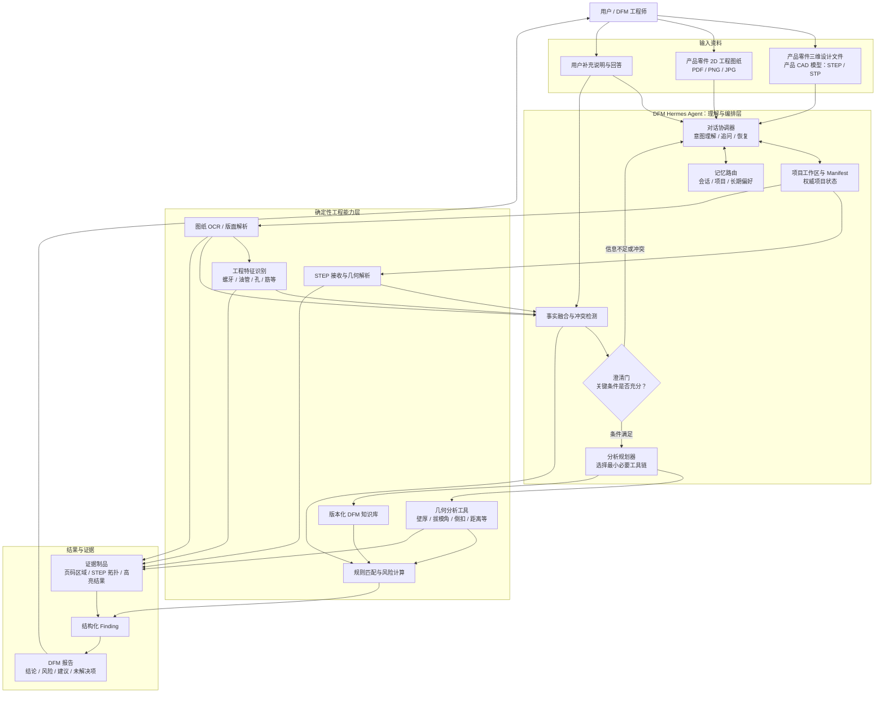

# DFM Hermes Agent 开发目标与路线图

> 本文档是 DFM Hermes Agent 的长期开发上下文，用于统一产品边界、架构、模块职责、数据契约、实施顺序和验收标准。每完成一个里程碑，应同步更新“状态跟踪”和“决策记录”。

## 1. 一页说明

### 1.1 当前要做什么

构建一个基于 Hermes 的注塑 DFM 分析智能体。它接收以下任意一种资料组合：

1. 产品零件的三维设计文件（也可称为产品三维 CAD 模型）：第一阶段支持 `STEP` / `STP` 格式；
2. 产品零件的 2D 工程图纸：例如 PDF、PNG、JPG；
3. 产品零件的三维设计文件与 2D 工程图纸同时提供。

智能体需要理解用户目标和输入资料，提取产品指标与局部特征，发现信息缺失或冲突并向用户追问，结合知识库规划需要调用的脚本和工具，执行确定性的几何计算与规则判断，最终输出有证据、有依据、可复核的 DFM 风险报告。

### 1.2 术语边界

“三维 CAD 模型”在本文中指**注塑产品零件本身的三维设计模型**，不指模具设计模型。因此，“支持产品三维 CAD 模型”可以作为 DFM 输入能力的描述，但必须同时写清产品对象和格式范围，避免被理解为模具设计或通用 CAD 能力。

第一阶段统一使用“产品零件三维设计文件（STEP/STP）”这一表述。STEP 文件保存的是可用于精确计算的 B-Rep 几何与拓扑数据，包括实体、曲面、曲线、边和顶点，并不是位图。DFM 工具利用这些数据进行三维几何解析、测量和结果高亮。

2D 工程图纸是产品零件的设计图稿，可包含矢量图元或栅格图像，主要用于提取尺寸、公差、材料、技术说明和局部特征。当前输入不包括模具设计模型或模具工程图，也不分析型芯、型腔、滑块、顶针、浇注系统、冷却系统等模具结构。

支持产品零件的三维设计数据不等于建设通用 CAD 平台。现阶段不要求支持原生 CAD 格式、装配体、参数化建模、模型编辑或格式转换。后续可以按 DFM 价值和解析能力逐步增加其他产品几何格式，但每种格式都需要单独验收。

### 1.3 当前明确不做什么

- 不接收或分析模具设计模型、模具装配文件和模具工程图纸。
- 不建设通用 CAD 查看、编辑或创作能力。
- 不自动修改客户的产品零件设计文件。
- 不让大语言模型直接生成壁厚、拔模角、距离或风险分数。
- 不在第一阶段同时覆盖注塑以外的全部制造工艺。

### 1.4 最终形态

DFM 能力应优先以独立软件包、Hermes 插件或独立智能体仓库实现，并通过 Hermes 的技能、插件或 MCP 等边缘扩展方式接入。这样既能在 `hermes-agent` 环境中使用，也保留后续单独发布 DFM 智能体的可能性，避免把行业专用能力写进 Hermes 核心。

## 2. 产品目标与成功标准

### 2.1 核心目标

- 能识别并管理 STEP、2D 图纸和混合输入。
- 能从图纸文本中提取材料、工艺、尺寸、公差、表面处理、技术说明和其他指标要求，并保留页码及区域证据。
- 能识别螺牙、油管/油路、孔、加强筋、凸台、密封区域、剖视图和局部详图等特征。
- 能根据局部特征选择不同规则。例如螺牙或油管附近的局部壁厚要求可以不同于普通区域。
- 能根据已知事实规划需要执行的分析项、脚本、工具及依赖顺序，而不是固定运行全部工具。
- 能在材料、工艺、单位、标称壁厚、拔模方向或特征位置不明确时追问用户。
- 能跨会话恢复项目，区分项目事实、用户偏好、分析结果和未确认假设。
- 能对每条风险说明：原始证据、测量值、适用规则、阈值、严重程度、置信度和改善建议。

### 2.2 成功标准

当一个开发人员只拿到本项目包和测试资料时，应能在不依赖其他业务系统的情况下完成以下闭环：

1. 创建或恢复 DFM 项目；
2. 登记 STEP、2D 图纸或两者；
3. 提取需求和工程特征；
4. 回答智能体提出的澄清问题；
5. 查看并确认分析计划；
6. 运行必要的确定性分析工具；
7. 检查证据和风险结论；
8. 中断后恢复分析；
9. 导出结构化结果和可读报告。

## 3. 三种输入模式及能力边界


| 输入模式       | 主要信息来源                             | 可以完成                                               | 必须提示的限制                                                                       |
| ---------------- | ------------------------------------------ | -------------------------------------------------------- | -------------------------------------------------------------------------------------- |
| 仅 STEP        | B-Rep 几何、拓扑、尺寸关系               | 几何有效性、壁厚、拔模角、倒扣、孔槽、距离等确定性检查 | 材料、工艺、公差和局部特殊要求可能缺失，需要追问或采用经用户确认的规则假设           |
| 仅 2D 图纸     | 标题栏、尺寸、公差、技术说明、视图和标注 | 文本指标提取、特征定位、规则预检查、资料完整性检查     | 没有可靠比例或明确尺寸时，不得从像素推断精确几何值；需要 STEP 的检查应标记为无法执行 |
| STEP + 2D 图纸 | 几何事实与设计要求的组合                 | 完整分析、图纸要求与几何测量交叉校验、局部特征规则应用 | 二维特征映射到 STEP 拓扑存在歧义时，必须保留置信度并请求确认                         |

无论哪种模式，智能体都不得用“看起来合理”的模型推断替代缺失的工程事实。无法计算时，应输出缺失条件和建议补充的资料，而不是伪造结果。

## 4. 总体架构



### 4.1 架构原则

1. **Hermes 负责判断“做什么”和“何时追问”。** 它管理对话、项目意图、分析规划、工具选择、记忆路由和结果解释。
2. **工程工具负责回答“算出了什么”。** OCR、STEP 解析、壁厚、拔模角、倒扣、距离、规则匹配和风险评分必须由可测试模块执行。
3. **项目状态不依赖聊天记录。** `project_manifest.json` 是项目事实的权威来源，聊天记录只用于对话连续性。
4. **风险结论必须有证据链。** 定量结论必须能回溯到输入、测量结果和版本化规则。
5. **行业能力位于 Hermes 边缘。** 优先使用独立包、插件、技能或 MCP，不为 DFM 修改 Hermes 核心工具集。

## 5. 工作原理与数据流

### 5.1 主流程

1. **建立项目**：为每次产品评审创建独立项目目录和 `project_manifest.json`。
2. **登记输入**：保存文件哈希、类型、版本、来源和处理状态，识别三种输入模式之一。
3. **安全预检**：校验路径、扩展名、文件大小、页数和几何复杂度，隔离不可信文件。
4. **并行提取**：
   - STEP 分支解析 B-Rep、单位、拓扑和可测量对象；
   - 图纸分支完成页面渲染、OCR、版面理解、尺寸/公差提取和特征定位。
5. **事实融合**：把用户说明、图纸要求、STEP 几何事实和历史确认项合并，保留来源、置信度和冲突。
6. **澄清门控**：若某项分析缺少关键条件，生成少量、具体、可回答的问题；答案写回项目事实后继续。
7. **形成计划**：根据输入模式、目标工艺、材料、特征和可用工具，生成结构化分析计划。
8. **执行工具**：按依赖顺序调用必要脚本，记录版本、参数、开始结束时间、状态、输出和错误。
9. **应用规则**：把测量结果与知识库规则进行确定性匹配和风险计算。
10. **形成发现**：每条 Finding 绑定测量证据、规则版本、严重程度、置信度和整改建议。
11. **生成报告**：输出结构化 JSON 和 Markdown，后续可选渲染 HTML/PDF。
12. **保存与恢复**：中断、失败或用户补充新版本文件后，从 Manifest 恢复并只重跑受影响步骤。

### 5.2 澄清机制

追问不是普通聊天，而是分析状态机的一部分。问题至少包含：

- 缺失或冲突的字段；
- 为什么该字段影响分析；
- 可接受的答案格式或选项；
- 不回答时哪些检查无法执行；
- 是否允许采用某个显式假设。

典型问题包括材料牌号、成型工艺、单位、标称壁厚、拔模方向、图纸版本、螺牙规格以及油管对应的视图或区域。用户回答必须记录为 `confirmed_fact`，不能混入模型自行推断的 `assumption`。

### 5.3 记忆模型


| 记忆层   | 保存内容                                               | 不应保存                       |
| ---------- | -------------------------------------------------------- | -------------------------------- |
| 会话记忆 | 当前问题、最近一次工具结果、临时对话上下文             | 项目唯一事实和大型分析制品     |
| 项目记忆 | 输入版本、提取事实、用户确认、计划、运行记录、风险发现 | 与项目无关的长期偏好           |
| 长期记忆 | 经确认的用户/公司术语、报告偏好、常用规则集选择        | 未经审核的测量结果和一次性假设 |

## 6. 功能模块

### 6.1 `coordinator`：DFM 对话协调器

- 识别用户是新建、继续、补充资料、纠正事实还是要求重新分析。
- 控制提取、澄清、计划、执行和报告阶段切换。
- 仅向用户提出当前最关键的问题。
- 根据项目状态恢复任务，不依赖长对话完整回放。

### 6.2 `project`：项目工作区与状态

- 管理项目 ID、输入文件、版本、哈希、制品和运行状态。
- 使用原子方式更新 Manifest，并支持模式迁移。
- 建立输入、事实、工具运行、证据和 Finding 的引用关系。
- 支持取消、失败恢复和增量重算。

### 6.3 `intake`：输入接收与分类

- 识别产品零件的 STEP/STP 三维设计文件、PDF 图纸和图纸图像。
- 检查文件有效性、大小和安全边界。
- 判断当前是仅 STEP、仅 2D 图纸还是混合输入。
- 为后续解析器建立标准化输入记录。

### 6.4 `drawing`：2D 图纸理解

- 页面渲染、OCR、版面和标题栏解析。
- 提取材料、尺寸、公差、技术说明和表面要求。
- 定位螺牙、油管/油路、孔、筋、凸台、密封区、剖视图和详图。
- 输出页面、视图、边界框、原文、规范化值和置信度。
- 低置信度结果进入人工确认，不直接成为工程事实。

### 6.5 `geometry`：STEP 几何分析

- 导入并验证 STEP B-Rep、单位和拓扑完整性。
- 执行壁厚、拔模角、倒扣、孔槽、间距和局部区域等检查。
- 对每个测量结果提供拓扑引用或可视化高亮制品。
- 在独立进程或隔离环境中运行，支持超时、取消和资源限制。

### 6.6 `fusion`：事实融合与特征关联

- 统一用户说明、图纸文本、图纸特征与 STEP 测量的术语和单位。
- 检测同一指标的不同来源是否一致。
- 建立二维特征到 STEP 拓扑的带置信度关联。
- 对无法可靠关联的螺牙、油管等局部特征请求用户确认。

### 6.7 `planning`：分析计划与工具编排

- 根据已确认事实选择最小必要工具集。
- 声明每个任务的输入、前置条件、预期输出和失败策略。
- 支持依赖排序、幂等运行、有限重试、超时、取消和恢复。
- 工具缺失或条件不满足时返回明确状态，不用 LLM 补值。

### 6.8 `knowledge`：知识库与规则

- 管理注塑 DFM 规则、术语、材料和特征专用阈值。
- 每条规则包含适用条件、单位、阈值、来源、版本和生效时间。
- 支持公司规则覆盖，但必须保留覆盖关系和来源。
- 找不到适用规则时返回 `rule_not_found`。

### 6.9 `risk`：风险计算

- 用测量值与规则阈值生成确定性的严重程度。
- 区分不符合、接近阈值、信息不足和工具失败。
- 处理局部特征规则，例如螺牙或油管周边壁厚。
- 同一输入、工具版本和规则版本必须得到相同结果。

### 6.10 `reporting`：证据与报告

- 生成统一 Finding、项目摘要和未解决问题清单。
- 生成图纸裁剪图、STEP 高亮和计算日志引用。
- 明确区分已确认事实、计算结果、假设和定性建议。
- 输出结构化 JSON 与 Markdown 报告。

## 7. 核心数据契约

### 7.1 项目清单

```json
{
  "schema_version": "1.0",
  "project_id": "dfm-20260713-001",
  "domain": "injection_molding",
  "input_mode": "step_and_drawing",
  "inputs": [],
  "facts": [],
  "clarifications": [],
  "features": [],
  "plans": [],
  "tool_runs": [],
  "findings": [],
  "artifacts": [],
  "status": "clarification_required"
}
```

### 7.2 工程事实

```json
{
  "fact_id": "fact-material-001",
  "name": "material",
  "value": "PA66-GF30",
  "unit": null,
  "state": "confirmed",
  "source": {
    "type": "drawing_region",
    "input_id": "drawing-v2",
    "page": 1,
    "bbox": [120, 85, 430, 145],
    "text": "MATERIAL: PA66-GF30"
  },
  "confidence": 0.99
}
```

### 7.3 分析计划

```json
{
  "plan_id": "plan-003",
  "tasks": [
    {
      "task_id": "wall-thickness-near-thread",
      "tool": "measure_local_wall_thickness",
      "depends_on": ["map-thread-to-step-region"],
      "required_facts": ["material", "thread_location"],
      "expected_outputs": ["measurement", "evidence_artifact"]
    }
  ]
}
```

### 7.4 风险发现

```json
{
  "finding_id": "finding-017",
  "check": "local_wall_thickness_near_thread",
  "severity": "high",
  "measurement": {"value": 0.82, "unit": "mm"},
  "requirement": {"operator": ">=", "value": 1.20, "unit": "mm"},
  "rule": {"id": "IM-THREAD-WALL-004", "version": "2026.07"},
  "evidence": ["step-region-245", "drawing-page2-thread-a"],
  "confidence": 0.94,
  "recommendation": "增加螺牙根部周边局部壁厚，并重新检查缩水与干涉风险。"
}
```

## 8. 建议目录结构

DFM 能力可能后续单独发布，因此建议从第一天按独立仓库或独立 Python 包组织。本文档暂放在 `hermes-agent` 中作为研发上下文，不代表实现代码必须进入 Hermes 核心仓库。

```text
hermes-dfm-agent/
├── pyproject.toml
├── README.md
├── config/
│   ├── defaults.yaml
│   └── logging.yaml
├── skills/
│   └── dfm-engineer/
│       ├── SKILL.md
│       └── references/
├── src/hermes_dfm/
│   ├── coordinator/
│   │   ├── agent.py
│   │   ├── state_machine.py
│   │   └── clarification.py
│   ├── project/
│   │   ├── manifest.py
│   │   ├── workspace.py
│   │   └── artifacts.py
│   ├── intake/
│   │   ├── classifier.py
│   │   └── validation.py
│   ├── drawing/
│   │   ├── render.py
│   │   ├── ocr.py
│   │   ├── requirements.py
│   │   └── features.py
│   ├── geometry/
│   │   ├── step_reader.py
│   │   ├── topology.py
│   │   ├── measurements.py
│   │   └── evidence.py
│   ├── fusion/
│   │   ├── facts.py
│   │   ├── conflicts.py
│   │   └── feature_mapping.py
│   ├── planning/
│   │   ├── contracts.py
│   │   ├── planner.py
│   │   └── executor.py
│   ├── knowledge/
│   │   ├── schema.py
│   │   ├── repository.py
│   │   └── matcher.py
│   ├── risk/
│   │   └── scoring.py
│   ├── reporting/
│   │   ├── findings.py
│   │   └── render.py
│   └── runtime/
│       ├── isolation.py
│       ├── limits.py
│       └── cancellation.py
├── rules/
│   └── injection_molding/
├── tests/
│   ├── contracts/
│   ├── unit/
│   ├── integration/
│   ├── e2e/
│   └── fixtures/
│       ├── step/
│       ├── drawings/
│       └── mixed/
└── docs/
    ├── architecture.md
    └── rule-authoring.md
```

## 9. 现有 DFM 代码的复用与借鉴

现有业务工程中的 DFM 代码是迁移来源和参考实现，不是新智能体的运行时依赖。迁移时应先通过基线测试固定现有有效行为，再逐步抽取领域算法，避免连同业务框架耦合一起搬迁。


| 现有位置                                                              | 可复用或借鉴                                          | 不应带入独立 DFM Agent                                         |
| ----------------------------------------------------------------------- | ------------------------------------------------------- | ---------------------------------------------------------------- |
| `backend/aimold_app/agents/skill/dfm-analysis/scripts/dfm_analyze.py` | STEP 读取、几何检查、指标计算、问题证据和结果生成思路 | Django settings、请求上下文、业务存储客户端和应用模型依赖      |
| `backend/aimold_app/agents/skill/dfm-analysis/SKILL.md`               | DFM 分析步骤、检查项、工具使用约束和输出表达          | 与当前应用页面或调用链绑定的说明                               |
| `backend/aimold_app/agents/model_DFM.py`                              | 现有智能体流程、提示词经验、进度/取消行为             | 单体式编排、业务接口适配和框架内状态                           |
| `backend/aimold_app/agents/modeltwo_d_evaluation_agent.py`            | 2D 图纸分析流程、文本提取需求和问答经验               | 只适用于当前业务入口的调用与存储逻辑                           |
| `backend/aimold_app/agents/model_evaluation_agent.py`                 | STEP 分析任务拆分和报告组织方式                       | 与业务模型、上传下载和响应格式耦合的部分                       |
| `backend/aimold_app/agents/doc/模具评审标准表.csv`                    | 初始规则来源、术语和检查项候选                        | 未经过版本、单位、适用条件和出处整理的原始表格直接进入评分引擎 |

复用优先级：

1. 保留已经验证有效的几何算法和证据生成方式；
2. 抽取纯 Python 契约与确定性函数；
3. 通过适配器隔离 OpenCascade、OCR 和视觉模型；
4. 重新实现项目状态与 Hermes 编排，不复制业务框架状态；
5. 用同一批 STEP/图纸夹具对比新旧结果，确认无意外行为变化。

## 10. SimpleCADAPI 的定位

SimpleCADAPI 当前只作为技术候选和设计参考，不作为已确定的生产依赖。

可借鉴的部分包括：

- 面向智能体的几何查询语言或选择器；
- 使用语义标签引用面、边、孔等拓扑对象；
- 以操作图记录几何步骤和对象关系；
- 将复杂 CAD 操作包装成边界清晰的工具函数。

采用前必须完成以下决策门：

- 验证是否能稳定导入和查询本项目的 STEP 夹具；
- 评估其 `OCP/cadquery-ocp` 与现有 `pythonocc-core/OCC.Core` 技术栈的兼容性和迁移成本；
- 验证是否能支持 DFM 所需的壁厚、拔模角、倒扣和局部距离等能力；
- 评估性能、维护活跃度和错误处理质量；
- 完成 AGPL-3.0 及商业发布场景的许可审查。

若以上条件不满足，只复用其查询、标签和操作图等设计思想，不直接引入依赖。

## 11. 开发计划

### M0：范围基线与验收语料库

**目标：** 固定当前注塑 DFM 的检查范围、术语、输入样本和可复现基线。

**主要工作：**

- 盘点现有 STEP、2D 图纸和 DFM 代码的实际行为。
- 建立检查项分类：全局几何、局部特征、图纸要求、资料完整性和规则风险。
- 建立仅 STEP、仅图纸、混合输入三类测试夹具。
- 记录当前算法的测量、Finding、运行时间和资源基线。
- 确认第一版支持的注塑材料、规则和局部特征范围。

**退出标准：** 每个夹具都有输入说明、预期工程关系和可重复的基线结果；团队能明确回答第一版“分析什么”和“不分析什么”。

### M1：独立 STEP 分析工具包

**目标：** 在不依赖现有业务工程的环境中运行 STEP DFM 分析。

**主要工作：**

- 抽取 STEP 解析、拓扑检查、几何测量和证据生成。
- 定义稳定的输入、输出和错误契约。
- 加入超时、取消、工作区隔离和资源限制。
- 使用 M0 夹具对比新旧结果。

**退出标准：** 独立命令可处理基线 STEP，输出符合契约且与确认的旧结果一致；环境中不需要业务框架配置。

### M2：项目状态与 Hermes DFM 技能

**目标：** 让 Hermes 能创建、恢复和管理一个可审计的 DFM 项目。

**主要工作：**

- 实现项目工作区、Manifest、文件哈希和制品管理。
- 实现输入分类、安全校验和三种输入模式判断。
- 编写 DFM 技能，定义阶段、工具约束、追问规则和报告原则。
- 实现中断、取消、恢复和增量更新。

**退出标准：** Hermes 会话可以可靠创建/恢复项目、登记文件、查看状态，不把聊天历史当成项目数据库。

### M3：2D 图纸文本理解与指标提取

**目标：** 从 2D 图纸中提取可追溯的产品指标要求。

**主要工作：**

- 页面渲染、OCR、标题栏与版面解析。
- 提取材料、尺寸、公差、技术说明、表面处理和单位。
- 输出原文、规范化值、页码、边界框和置信度。
- 实现冲突检测、澄清问题和用户确认写回。

**退出标准：** 已知指标能连同证据正确提取；关键值缺失或冲突时会追问；仅图纸输入不会触发不具备条件的精确几何计算。

### M4：2D 工程特征识别

**目标：** 定位影响局部 DFM 规则的图纸特征。

**主要工作：**

- 建立螺牙、油管/油路、孔、筋、凸台、密封区、剖视图和详图的标注体系。
- 训练或配置视觉识别流程，输出页面/视图/边界框和置信度。
- 支持跨视图关联和人工确认。
- 建立按特征类别统计的精确率、召回率和定位指标。

**退出标准：** 达到 M0 批准的各类别阈值；低置信度特征不会被静默写成已确认事实。

### M5：事实融合、分析规划与工具编排

**目标：** 根据资料组合和已确认事实选择正确且最小的分析工具链。

**主要工作：**

- 融合用户说明、图纸指标、二维特征与 STEP 拓扑事实。
- 实现带置信度的二维特征到 STEP 区域关联。
- 定义分析计划契约、前置条件和预期输出。
- 实现依赖执行、有限重试、超时、取消、恢复和幂等记录。

**退出标准：** 场景测试证明：工具选择符合输入模式和特征；关键条件不足时先追问；失败后可安全恢复且不重复污染结果。

### M6：版本化知识库与确定性风险计算

**目标：** 把工程事实和测量结果转换为可审计的注塑风险。

**主要工作：**

- 整理并版本化初始注塑规则、术语和来源。
- 实现按材料、工艺、特征、单位和区域匹配规则。
- 实现局部特征专用规则与公司覆盖规则。
- 实现确定性严重程度计算和 `rule_not_found` 等明确状态。

**退出标准：** 相同输入、工具版本和规则版本重复运行得到相同测量、阈值和严重程度；不存在由 LLM 编造的数值。

### M7：报告、端到端验收与独立发布准备

**目标：** 完成可单独使用和发布的 DFM Hermes Agent 闭环。

**主要工作：**

- 生成结构化 Finding、Markdown 报告和证据制品。
- 支持项目摘要、未解决项和不同分析版本对比。
- 完成仅 STEP、仅图纸和混合输入的端到端验收。
- 整理安装、配置、示例、规则编写和故障排查文档。
- 确认独立包/插件的版本策略、依赖上限和许可证清单。

**退出标准：** 用户可通过 Hermes 完成资料输入、追问、确认、分析、证据检查和报告导出；软件包不依赖其他业务系统，可作为独立 DFM 智能体候选版本发布。

## 12. 测试与验收策略

### 12.1 测试层级

- **契约测试**：Manifest、Fact、Feature、Plan、ToolRun、Finding 和 Rule。
- **单元测试**：单位规范化、规则匹配、风险计算、冲突检测和状态迁移。
- **几何测试**：使用已知尺寸的 STEP 夹具验证壁厚、角度、距离和拓扑关系。
- **图纸测试**：使用合成图纸和真实脱敏图纸验证 OCR、指标提取和证据位置。
- **视觉评估**：按螺牙、油管等类别统计精确率、召回率和定位质量。
- **规划场景测试**：验证输入模式、缺失条件、工具选择和澄清门控。
- **端到端测试**：验证三种输入模式下的完整项目闭环和恢复行为。
- **安全测试**：畸形 STEP、超大文件、路径遍历、恶意图纸文字、超时、取消和资源耗尽。

### 12.2 必须验证的不变量

- LLM 不产生任何没有工具证据的定量测量或风险分数。
- 找不到规则或无法计算时输出明确状态，不产生“最佳猜测”。
- 每条定量 Finding 都引用一个测量结果和一个版本化规则。
- 项目恢复前后，已确认事实和制品引用保持一致。
- 相同版本的输入、工具和规则产生可复现结果。
- 仅图纸输入不会假装完成需要 STEP 的检查。
- 低置信度二维特征不会自动升级为已确认事实。

### 12.3 指标

- 图纸指标提取准确率与证据区域正确率；
- 特征识别精确率、召回率和定位误差；
- STEP 几何测量误差；
- 规则匹配准确率；
- 各 DFM 检查项的误报率和漏报率；
- 缺少关键事实时的追问正确率；
- 重复运行可复现率；
- 取消延迟、恢复正确性和工作区清理正确性。

具体数值阈值必须在 M0 建立代表性语料库后由工程团队批准，不能由文档预先猜测。

## 13. 安全与运行约束

- 每个项目和每次运行使用隔离工作区。
- 所有输入文件、CAD 元数据、图纸文字和 OCR 结果都视为不可信数据，不作为智能体指令执行。
- 校验所有相对路径，禁止越过工作区根目录。
- 限制文件大小、页数、几何复杂度、运行时间、内存和输出大小。
- 重型几何分析与不可信解析器在可终止子进程或隔离环境中运行。
- 记录工具版本、参数、开始/结束时间、退出状态和经过净化的错误信息。
- 非机密行为配置写入 YAML；环境变量仅保存密钥和凭据。
- 新依赖必须设置版本范围，记录许可证并接受供应链审查。

## 14. 主要风险与应对


| 风险                                       | 应对措施                                                                           |
| -------------------------------------------- | ------------------------------------------------------------------------------------ |
| 图纸视觉模型识别出看似合理但位置错误的特征 | 强制输出页码、视图、边界框和置信度；使用带标注语料评估；关键低置信度结果由用户确认 |
| LLM 编造工程数值或风险                     | 定量结果只能来自确定性工具；Finding 验证器拒绝没有测量和规则引用的结论             |
| 二维特征无法可靠映射到 STEP 拓扑           | 使用带置信度的关联，保留候选和未解决状态，不强制生成唯一映射                       |
| 现有算法与业务框架耦合过深                 | 先建立行为基线，再抽取纯函数和契约；不把业务存储、请求上下文和模型依赖带入新包     |
| 项目状态被错误存进 Hermes 长期记忆         | 以 Manifest 为权威状态，长期记忆只保存审核后的偏好和术语                           |
| 重型几何依赖影响 Hermes 稳定性             | 独立进程/环境运行，通过精简 JSON 契约交互                                          |
| SimpleCADAPI 引入技术或许可锁定            | 置于 PoC 和许可决策门之后，必要时只借鉴设计理念                                    |
| 范围扩张为通用制造平台                     | 第一阶段只做注塑 DFM；其他工艺按独立规则和工具包立项                               |

## 15. 决策记录


| 日期       | 决策                                                                                    | 原因                                                                           |
| ------------ | ----------------------------------------------------------------------------------------- | -------------------------------------------------------------------------------- |
| 2026-07-13 | 当前输入定义为产品零件三维设计文件（第一阶段为 STEP/STP）、产品零件 2D 图纸或两者组合。 | “产品三维 CAD 模型”是合法概念，但必须与模具设计模型和通用 CAD 平台明确区分。 |
| 2026-07-13 | 当前文档只描述 Hermes Agent 层及其独立工程能力。                                        | 现阶段目标是验证完整 DFM 能力，不让其他业务系统的实现细节干扰架构。            |
| 2026-07-13 | DFM 实现优先采用独立包、插件或独立智能体仓库。                                          | 符合 Hermes 的边缘扩展原则，并保留单独发布的可能性。                           |
| 2026-07-13 | Hermes 负责编排，确定性工具负责工程计算和风险评分。                                     | 对话和工具选择适合智能体；工程数值需要可重复、可测试和可审计。                 |
| 2026-07-13 | 项目 Manifest 是事实来源，聊天和长期记忆不是项目数据库。                                | DFM 分析需要恢复、版本管理和证据追溯。                                         |
| 2026-07-13 | 现有业务工程中的 DFM 代码作为迁移来源和参考实现。                                       | 已有算法和流程具有复用价值，但新智能体不能依赖业务框架运行。                   |
| 2026-07-13 | SimpleCADAPI 仅作为评估候选。                                                           | 查询和标签设计有价值，但 DFM 能力、技术兼容性和许可仍需验证。                  |
| 2026-07-13 | 第一阶段制造领域限定为注塑。                                                            | 先完成可验收闭环，再评估扩展到其他工艺。                                       |

## 16. 状态跟踪


| 里程碑                            | 状态   | 证据/链接 |
| ----------------------------------- | -------- | ----------- |
| M0 范围基线与验收语料库           | 未开始 |           |
| M1 独立 STEP 分析工具包           | 未开始 |           |
| M2 项目状态与 Hermes DFM 技能     | 未开始 |           |
| M3 2D 图纸文本理解与指标提取      | 未开始 |           |
| M4 2D 工程特征识别                | 未开始 |           |
| M5 事实融合、分析规划与工具编排   | 未开始 |           |
| M6 版本化知识库与确定性风险计算   | 未开始 |           |
| M7 报告、端到端验收与独立发布准备 | 未开始 |           |

允许的状态：`未开始`、`设计中`、`进行中`、`受阻`、`评审中`、`已完成`。

## 17. 下一步工作

下一份可执行实施计划只覆盖 M0，建议按以下顺序开展：

1. 盘点现有 DFM、2D 图纸分析和 STEP 分析代码，列出可复用函数、耦合点和行为基线。
2. 从 `模具评审标准表.csv` 和现有实现中整理第一版注塑检查项分类，但暂不直接形成生产规则。
3. 建立三类脱敏夹具：仅 STEP、仅图纸、STEP + 图纸。
4. 为每个夹具编写预期工程关系、应触发检查、应追问字段和不应执行的检查。
5. 运行现有分析器，保存测量、风险、制品、时间和资源占用基线。
6. 确认独立 DFM 包的实际仓库位置和 Python/OpenCascade 依赖基线。
7. 单独完成 SimpleCADAPI 的兼容性 PoC 与许可审查结论。

M0 未通过评审前，不开始大规模 OCR 模型训练、Hermes 核心修改或其他制造工艺扩展。

## 18. 文档维护规则

- 里程碑范围、状态或退出标准变化时更新本文档。
- 新决策追加到决策记录；不要在没有替代说明的情况下删除历史决策。
- 数据契约示例应与已实现模式同步。
- 每个里程碑的实施计划、测试报告和验收证据应链接到状态表。
- 具体代码步骤拆分到独立实施计划，本文档保持为产品与架构的长期上下文。
- 规则阈值、测试数据和运行结果应存放在各自版本化文件中，不以本文档代替。
