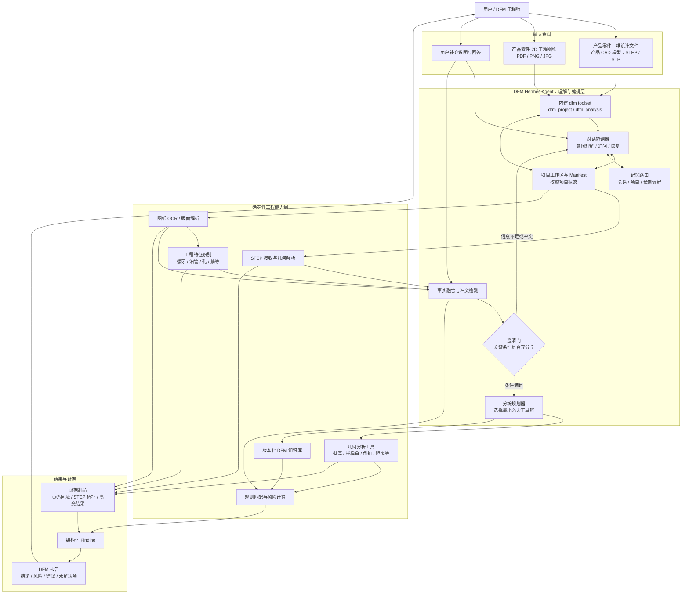

# DFM Hermes Agent 开发目标与路线图

> 本文档是 DFM Hermes Agent 的长期开发上下文，用于统一产品边界、架构、模块职责、数据契约、实施顺序和验收标准。每完成一个里程碑，应同步更新“状态跟踪”和“决策记录”。

## 1. 一页说明

### 1.1 当前要做什么

构建一个基于 Hermes 的注塑 DFM 分析智能体。它接收以下任意一种资料组合：

1. 产品零件的三维设计文件（也可称为产品三维 CAD 模型）：第一阶段支持 `STEP` / `STP` 格式；
2. 产品零件的 2D 工程图纸：例如 PDF、PNG、JPG；
3. 产品零件的三维设计文件与 2D 工程图纸同时提供。

智能体需要理解用户目标和输入资料，提取产品指标与局部特征，发现信息缺失或冲突并向用户追问，结合知识库规划需要调用的脚本和工具，执行确定性的几何计算与规则判断，最终输出有证据、有依据、可复核的 DFM 风险报告。

### 1.2 术语边界

“三维 CAD 模型”在本文中指**注塑产品零件本身的三维设计模型**，不指模具设计模型。因此，“支持产品三维 CAD 模型”可以作为 DFM 输入能力的描述，但必须同时写清产品对象和格式范围，避免被理解为模具设计或通用 CAD 能力。

第一阶段统一使用“产品零件三维设计文件（STEP/STP）”这一表述。STEP 文件保存的是可用于精确计算的 B-Rep 几何与拓扑数据，包括实体、曲面、曲线、边和顶点，并不是位图。DFM 工具利用这些数据进行三维几何解析、测量和结果高亮。

2D 工程图纸是产品零件的设计图稿，可包含矢量图元或栅格图像，主要用于提取尺寸、公差、材料、技术说明和局部特征。当前输入不包括模具设计模型或模具工程图，也不分析型芯、型腔、滑块、顶针、浇注系统、冷却系统等模具结构。

支持产品零件的三维设计数据不等于建设通用 CAD 平台。现阶段不要求支持原生 CAD 格式、装配体、参数化建模、模型编辑或格式转换。后续可以按 DFM 价值和解析能力逐步增加其他产品几何格式，但每种格式都需要单独验收。

### 1.3 当前明确不做什么

- 不接收或分析模具设计模型、模具装配文件和模具工程图纸。
- 不建设通用 CAD 查看、编辑或创作能力。
- 不自动修改客户的产品零件设计文件。
- 不让大语言模型直接生成壁厚、拔模角、距离或风险分数。
- 不在第一阶段同时覆盖注塑以外的全部制造工艺。

### 1.4 最终形态

第一版定位为**当前 Hermes fork 自带的内建 DFM 能力**。它使用 Hermes 已有的工具注册、toolset、技能、配置、会话工作区和 Desktop/Gateway 能力，不另建一套 Agent Loop，也不要求第一天就能脱离 Hermes 单独发布。

DFM 采用“内建代码、按需启用”的方式：

- `tools/dfm_tool.py` 只负责稳定的模型工具 Schema 和 Hermes 适配；
- 领域实现放在 `tools/dfm/`，不堆入 `run_agent.py`、`model_tools.py` 或 `cli.py`；
- 工具归属独立的 `dfm` toolset，默认关闭，不加入 `_HERMES_CORE_TOOLS`；
- 用户通过 `hermes tools` 为指定平台启用 DFM，新会话建立后工具集保持稳定；
- `skills/manufacturing/dfm-analysis/` 负责分析流程、追问规则和结果表达；
- OpenCascade、OCR 等重型能力通过分析器接口和可终止运行时隔离。

这种形态允许在当前仓库快速完成端到端闭环，同时保留以后把 `tools/dfm/` 中的纯领域模块抽取为独立软件包或 MCP 服务的可能性，但“可独立发布”不是第一版前置条件。

## 2. 产品目标与成功标准

### 2.1 核心目标

- 能识别并管理 STEP、2D 图纸和混合输入。
- 能从图纸文本中提取材料、工艺、尺寸、公差、表面处理、技术说明和其他指标要求，并保留页码及区域证据。
- 能识别螺牙、油管/油路、孔、加强筋、凸台、密封区域、剖视图和局部详图等特征。
- 能根据局部特征选择不同规则。例如螺牙或油管附近的局部壁厚要求可以不同于普通区域。
- 能根据已知事实规划需要执行的分析项、脚本、工具及依赖顺序，而不是固定运行全部工具。
- 能在材料、工艺、单位、标称壁厚、拔模方向或特征位置不明确时追问用户。
- 能跨会话恢复项目，区分项目事实、用户偏好、分析结果和未确认假设。
- 能对每条风险说明：原始证据、测量值、适用规则、阈值、严重程度、置信度和改善建议。

### 2.2 终极成功标准

当一个开发人员只拿到本项目包和测试资料时，应能在不依赖其他业务系统的情况下完成以下闭环：

1. 创建或恢复 DFM 项目；
2. 登记 STEP、2D 图纸或两者；
3. 提取需求和工程特征；
4. 回答智能体提出的澄清问题；
5. 查看并确认分析计划；
6. 运行必要的确定性分析工具；
7. 检查证据和风险结论；
8. 中断后恢复分析；
9. 导出结构化结果和可读报告。

### 2.3 第一阶段成功标准

第一阶段不要求立即实现上述全部领域算法，而是先验证终极架构可以承载它们：

1. Hermes 可以启用独立的 `dfm` toolset，未启用时 DFM Schema 不进入模型请求；
2. 可以创建、恢复和查询 profile-aware 的 DFM 项目；
3. 可以登记 STEP、2D 图纸和混合输入，并得到明确的能力状态；
4. STEP 分析器尚未接入时返回 `dependency_missing` 或 `not_implemented`，2D/融合模块未实现时返回 `not_implemented` 并附错误码 `unsupported_capability`，不得生成模拟 Finding；
5. 分析任务具有稳定的 `start/status/cancel/result` 生命周期，长任务不阻塞一次模型工具调用；
6. 所有项目状态、运行记录和制品引用都可从 Manifest 恢复；
7. Desktop 现有 `file.attach` 与 Artifacts 页面能够承接输入和结果，不要求先开发 DFM 专用页面；
8. 真实 STEP 分析器接入时不需要修改工具 Schema、Manifest 主结构或 Desktop 上传协议。

## 3. 三种输入模式及能力边界


| 输入模式       | 主要信息来源                             | 可以完成                                               | 必须提示的限制                                                                       |
| ---------------- | ------------------------------------------ | -------------------------------------------------------- | -------------------------------------------------------------------------------------- |
| 仅 STEP        | B-Rep 几何、拓扑、尺寸关系               | 几何有效性、壁厚、拔模角、倒扣、孔槽、距离等确定性检查 | 材料、工艺、公差和局部特殊要求可能缺失，需要追问或采用经用户确认的规则假设           |
| 仅 2D 图纸     | 标题栏、尺寸、公差、技术说明、视图和标注 | 文本指标提取、特征定位、规则预检查、资料完整性检查     | 没有可靠比例或明确尺寸时，不得从像素推断精确几何值；需要 STEP 的检查应标记为无法执行 |
| STEP + 2D 图纸 | 几何事实与设计要求的组合                 | 完整分析、图纸要求与几何测量交叉校验、局部特征规则应用 | 二维特征映射到 STEP 拓扑存在歧义时，必须保留置信度并请求确认                         |

无论哪种模式，智能体都不得用“看起来合理”的模型推断替代缺失的工程事实。无法计算时，应输出缺失条件和建议补充的资料，而不是伪造结果。

## 4. 总体架构



### 4.1 架构原则

1. **Hermes 负责判断“做什么”和“何时追问”。** 它管理对话、项目意图、分析规划、工具选择、记忆路由和结果解释。
2. **工程工具负责回答“算出了什么”。** OCR、STEP 解析、壁厚、拔模角、倒扣、距离、规则匹配和风险评分必须由可测试模块执行。
3. **项目状态不依赖聊天记录。** `project_manifest.json` 是项目事实的权威来源，聊天记录只用于对话连续性。
4. **风险结论必须有证据链。** 定量结论必须能回溯到输入、测量结果和版本化规则。
5. **内建但不侵入核心循环。** DFM 可以作为当前 fork 的常驻源码能力，但只能通过独立 toolset 和薄适配器接入；不修改 Agent Loop，不加入 `_HERMES_CORE_TOOLS`，未启用时不向模型发送 DFM Schema。
6. **会话内工具 Schema 稳定。** 依赖状态变化通过结构化能力状态返回，不在同一会话中反复增删工具；配置变化在新会话或明确重载后生效，以保护提示词缓存。
7. **未实现能力必须显式失败。** 预留模块可以被注册和查询，但只能返回 `not_implemented`、`unsupported_capability`、`dependency_missing` 等状态，不得返回占位测量或模拟 Finding。
8. **界面复用 Hermes 现有能力。** Desktop、TUI、CLI 和 Gateway 是交互入口；DFM 领域层只处理规范化输入引用与 artifact，不拥有第二套聊天、上传或会话系统。

### 4.2 Hermes 内建接入方式

第一版提供两个模型工具，二者都归属 `dfm` toolset：

| 工具 | 动作 | 职责 |
| --- | --- | --- |
| `dfm_project` | `create`、`add_input`、`status`、`confirm_fact`、`list` | 管理项目、输入、能力状态和用户确认，不执行重型分析 |
| `dfm_analysis` | `plan`、`start`、`status`、`cancel`、`result` | 管理分析计划与长任务生命周期，返回结构化运行状态和 artifact 引用 |

接入约束：

- `tools/dfm_tool.py` 包含顶层 `registry.register(...)` 调用，以复用 Hermes 当前的自动发现机制；
- `toolsets.py` 增加独立 `dfm` toolset，但 `_HERMES_CORE_TOOLS` 不包含任何 DFM 工具；
- `hermes_cli/tools_config.py` 将 `dfm` 展示在 `hermes tools` 中并列入默认关闭集合；
- 工具 `check_fn` 只做快速、稳定、无副作用的基础可用性检查，不探测网络、不安装依赖，也不因一次临时故障改变会话工具集；
- OpenCascade/OCR 是否可运行由 `dfm_project status` 和 `dfm_analysis start` 返回的 capability 状态说明；
- 非机密配置读取 `config.yaml` 的 `dfm.*`，不得新增面向用户的非机密 `HERMES_*` 环境变量。

### 4.3 Desktop 与现有 Gateway 复用

Desktop 已经提供文件选择、拖放、会话附件、远程文件暂存和 Artifacts 页面。DFM 接入按以下方式复用：

1. Desktop 使用现有 `file.attach` 将 STEP/STP、PDF、PNG、JPG 暂存到会话工作区并生成 `@file:` 引用；
2. Agent 将该引用传给 `dfm_project(add_input)`，DFM intake 校验后复制或登记到项目 `inputs/`；
3. `dfm_analysis(result)` 返回带 `path`、`artifact`、`result`、`image` 等明确字段的结构化 artifact 列表；
4. Desktop 现有 Artifacts 页面从工具结果和 Assistant 消息中收集报告、JSON、PNG 和高亮 STEP；
5. 后续可以增加 DFM 项目状态、Finding 检查器或 3D 预览等结构化侧栏，但不得重写 Desktop 的主聊天、composer、附件和会话传输。

当前 `file.attach` 的远程非图片上传会在 Gateway 内存中解码完整文件。进入生产验收前必须补充通用文件大小上限，或为大型 STEP 增加分块/直传能力；DFM intake 的落盘后校验不能替代上传前的传输层限制。

## 5. 工作原理与数据流

### 5.1 主流程

1. **建立项目**：`dfm_project(create)` 在当前 Hermes profile 的 DFM 工作区创建独立项目目录和 `project_manifest.json`。
2. **登记输入**：保存文件哈希、类型、版本、来源和处理状态，识别三种输入模式之一。
3. **安全预检**：校验路径、扩展名、文件大小、页数和几何复杂度，隔离不可信文件。
4. **并行提取**：
   - STEP 分支解析 B-Rep、单位、拓扑和可测量对象；
   - 图纸分支完成页面渲染、OCR、版面理解、尺寸/公差提取和特征定位。
5. **事实融合**：把用户说明、图纸要求、STEP 几何事实和历史确认项合并，保留来源、置信度和冲突。
6. **澄清门控**：若某项分析缺少关键条件，生成少量、具体、可回答的问题；答案写回项目事实后继续。
7. **形成计划**：根据输入模式、目标工艺、材料、特征和可用工具，生成结构化分析计划。
8. **启动运行**：`dfm_analysis(start)` 先持久化 Run，再启动可终止后台任务并立即返回 `run_id`；调用方通过 `status/cancel/result` 管理长任务。
9. **应用规则**：把测量结果与知识库规则进行确定性匹配和风险计算。
10. **形成发现**：每条 Finding 绑定测量证据、规则版本、严重程度、置信度和整改建议。
11. **生成报告**：输出结构化 JSON 和 Markdown，后续可选渲染 HTML/PDF。
12. **保存与恢复**：中断、失败或用户补充新版本文件后，从 Manifest 恢复并只重跑受影响步骤。

### 5.2 澄清机制

追问不是普通聊天，而是分析状态机的一部分。问题至少包含：

- 缺失或冲突的字段；
- 为什么该字段影响分析；
- 可接受的答案格式或选项；
- 不回答时哪些检查无法执行；
- 是否允许采用某个显式假设。

典型问题包括材料牌号、成型工艺、单位、标称壁厚、拔模方向、图纸版本、螺牙规格以及油管对应的视图或区域。用户回答必须记录为 `confirmed_fact`，不能混入模型自行推断的 `assumption`。

### 5.3 记忆模型


| 记忆层   | 保存内容                                               | 不应保存                       |
| ---------- | -------------------------------------------------------- | -------------------------------- |
| 会话记忆 | 当前问题、最近一次工具结果、临时对话上下文             | 项目唯一事实和大型分析制品     |
| 项目记忆 | 输入版本、提取事实、用户确认、计划、运行记录、风险发现 | 与项目无关的长期偏好           |
| 长期记忆 | 经确认的用户/公司术语、报告偏好、常用规则集选择        | 未经审核的测量结果和一次性假设 |

## 6. 功能模块

### 6.1 `dfm_tool` 与 `coordinator`：Hermes 适配和对话协调

- 在 `tools/dfm_tool.py` 注册 `dfm_project` 和 `dfm_analysis`，不承载领域算法。
- 把工具参数转换为 `tools/dfm/` 中的类型化服务调用，并把结果序列化为稳定 JSON。
- 识别用户是新建、继续、补充资料、纠正事实还是要求重新分析。
- 控制提取、澄清、计划、执行和报告阶段切换。
- 仅向用户提出当前最关键的问题。
- 根据项目状态恢复任务，不依赖长对话完整回放。

### 6.2 `project`：项目工作区与状态

- 管理项目 ID、输入文件、版本、哈希、制品和运行状态。
- 使用原子方式更新 Manifest，并支持模式迁移。
- 建立输入、事实、工具运行、证据和 Finding 的引用关系。
- 支持取消、失败恢复和增量重算。

### 6.3 `intake`：输入接收与分类

- 识别产品零件的 STEP/STP 三维设计文件、PDF 图纸和图纸图像。
- 检查文件有效性、大小和安全边界。
- 判断当前是仅 STEP、仅 2D 图纸还是混合输入。
- 为后续解析器建立标准化输入记录。

### 6.4 `drawing`：2D 图纸理解

- 页面渲染、OCR、版面和标题栏解析。
- 提取材料、尺寸、公差、技术说明和表面要求。
- 定位螺牙、油管/油路、孔、筋、凸台、密封区、剖视图和详图。
- 输出页面、视图、边界框、原文、规范化值和置信度。
- 低置信度结果进入人工确认，不直接成为工程事实。

### 6.5 `geometry`：STEP 几何分析

- 导入并验证 STEP B-Rep、单位和拓扑完整性。
- 执行壁厚、拔模角、倒扣、孔槽、间距和局部区域等检查。
- 对每个测量结果提供拓扑引用或可视化高亮制品。
- 在独立进程或隔离环境中运行，支持超时、取消和资源限制。

### 6.6 `fusion`：事实融合与特征关联

- 统一用户说明、图纸文本、图纸特征与 STEP 测量的术语和单位。
- 检测同一指标的不同来源是否一致。
- 建立二维特征到 STEP 拓扑的带置信度关联。
- 对无法可靠关联的螺牙、油管等局部特征请求用户确认。

### 6.7 `planning`：分析计划与工具编排

- 根据已确认事实选择最小必要工具集。
- 声明每个任务的输入、前置条件、预期输出和失败策略。
- 支持依赖排序、幂等运行、有限重试、超时、取消和恢复。
- 工具缺失或条件不满足时返回明确状态，不用 LLM 补值。

### 6.8 `knowledge`：知识库与规则

- 管理注塑 DFM 规则、术语、材料和特征专用阈值。
- 每条规则包含适用条件、单位、阈值、来源、版本和生效时间。
- 支持公司规则覆盖，但必须保留覆盖关系和来源。
- 找不到适用规则时返回 `rule_not_found`。

### 6.9 `risk`：风险计算

- 用测量值与规则阈值生成确定性的严重程度。
- 区分不符合、接近阈值、信息不足和工具失败。
- 处理局部特征规则，例如螺牙或油管周边壁厚。
- 同一输入、工具版本和规则版本必须得到相同结果。

### 6.10 `reporting`：证据与报告

- 生成统一 Finding、项目摘要和未解决问题清单。
- 生成图纸裁剪图、STEP 高亮和计算日志引用。
- 明确区分已确认事实、计算结果、假设和定性建议。
- 输出结构化 JSON 与 Markdown 报告。

### 6.11 `runtime`：能力注册与长任务运行

- `Analyzer` 接口统一声明 `name`、`version`、`supported_inputs`、`capabilities()`、`plan()` 和 `run()`。
- `AnalyzerRegistry` 根据输入模式和计划选择 STEP、drawing、fusion 等实现，不由工具 adapter 写条件分支。
- STEP、drawing 和 fusion 从 M0 起都具有可查询的适配器；未实现适配器返回明确状态。
- Run 状态固定为 `queued`、`running`、`succeeded`、`failed`、`cancelled`、`blocked`，任何状态迁移先落 Manifest 再对外返回。
- 重型分析运行在可终止子进程或隔离环境，stdout 事件只能更新进度和 artifact，不能直接修改权威项目事实。
- 运行器记录解释器、分析器版本、参数、输入哈希、PID、时间、退出码和净化后的错误。

### 6.12 `config`：配置与依赖诊断

- `dfm.*` 行为配置来自 profile-aware 的 `config.yaml`。
- 第一版至少定义分析器解释器、默认工艺、文件/页数上限、运行超时、并发数和项目保留策略。
- `hermes dfm doctor` 只诊断 Python/OpenCascade/渲染依赖和目录权限；安装动作必须由用户显式触发。
- Hermes 主环境导入 DFM 工具时不得导入 `OCC.Core`、VTK 或 CADQuery；重型依赖只在分析进程内加载。

## 7. 核心数据契约

### 7.1 项目清单

```json
{
  "schema_version": "1.0",
  "project_id": "dfm-20260713-001",
  "domain": "injection_molding",
  "input_mode": "step_and_drawing",
  "revision": 4,
  "capabilities": {
    "step": {"status": "available", "analyzer": "pythonocc-step"},
    "drawing": {"status": "not_implemented", "analyzer": null},
    "fusion": {"status": "not_implemented", "analyzer": null}
  },
  "inputs": [],
  "facts": [],
  "clarifications": [],
  "features": [],
  "plans": [],
  "tool_runs": [],
  "findings": [],
  "artifacts": [],
  "status": "clarification_required"
}
```

### 7.2 工程事实

```json
{
  "fact_id": "fact-material-001",
  "name": "material",
  "value": "PA66-GF30",
  "unit": null,
  "state": "confirmed",
  "source": {
    "type": "drawing_region",
    "input_id": "drawing-v2",
    "page": 1,
    "bbox": [120, 85, 430, 145],
    "text": "MATERIAL: PA66-GF30"
  },
  "confidence": 0.99
}
```

### 7.3 分析计划

```json
{
  "plan_id": "plan-003",
  "tasks": [
    {
      "task_id": "wall-thickness-near-thread",
      "tool": "measure_local_wall_thickness",
      "depends_on": ["map-thread-to-step-region"],
      "required_facts": ["material", "thread_location"],
      "expected_outputs": ["measurement", "evidence_artifact"]
    }
  ]
}
```

### 7.4 风险发现

```json
{
  "finding_id": "finding-017",
  "check": "local_wall_thickness_near_thread",
  "severity": "high",
  "measurement": {"value": 0.82, "unit": "mm"},
  "requirement": {"operator": ">=", "value": 1.20, "unit": "mm"},
  "rule": {"id": "IM-THREAD-WALL-004", "version": "2026.07"},
  "evidence": ["step-region-245", "drawing-page2-thread-a"],
  "confidence": 0.94,
  "recommendation": "增加螺牙根部周边局部壁厚，并重新检查缩水与干涉风险。"
}
```

### 7.5 分析器能力

```json
{
  "analyzer": "drawing",
  "version": null,
  "status": "not_implemented",
  "supported_inputs": ["pdf", "png", "jpg"],
  "reason": "drawing analyzer adapter exists but no production implementation is configured",
  "next_action": "continue_with_step_only_or_install_drawing_backend"
}
```

`status` 只允许使用 `available`、`dependency_missing`、`not_implemented`、`disabled`、`unhealthy`。基础框架中的占位适配器只能返回这些能力状态，不能返回占位测量。

### 7.6 分析运行

```json
{
  "run_id": "run-20260713-0007",
  "project_id": "dfm-20260713-001",
  "plan_id": "plan-003",
  "status": "running",
  "input_hashes": ["sha256:..."],
  "analyzers": [{"name": "pythonocc-step", "version": "legacy-baseline-1"}],
  "created_at": "2026-07-13T09:30:00Z",
  "started_at": "2026-07-13T09:30:01Z",
  "finished_at": null,
  "progress": {"stage": "geometry", "percent": 35},
  "error": null,
  "artifact_ids": []
}
```

### 7.7 制品引用

```json
{
  "artifact_id": "artifact-run7-report-md",
  "run_id": "run-20260713-0007",
  "kind": "report",
  "media_type": "text/markdown",
  "path": "reports/run-20260713-0007/dfm_report.md",
  "sha256": "...",
  "size_bytes": 18420,
  "created_by": "pythonocc-step",
  "source_refs": ["input-step-v1"]
}
```

Manifest 保存相对项目根目录的 canonical path；工具结果可以同时返回为当前运行环境解析后的绝对路径，便于 Desktop Artifacts 页面发现和打开。URL 是交付层派生值，不写成领域层的唯一标识。

## 8. 建议目录结构

第一版直接在当前 `hermes-agent` fork 中实现，并遵循现有工具、技能、测试和打包目录。基础架构按终极模块边界设计，但 M0 只创建有真实调用方的骨架、契约和明确失败的适配器，避免大量无行为的空文件。

```text
hermes-agent/
├── tools/
│   ├── dfm_tool.py                  # 唯一的 Hermes 工具注册与参数适配入口
│   └── dfm/
│       ├── __init__.py
│       ├── contracts.py             # Project/Input/Fact/Plan/Run/Finding/Artifact
│       ├── errors.py                # 稳定错误码和可恢复性分类
│       ├── config.py                # profile-aware config.yaml 读取和校验
│       ├── service.py               # dfm_project / dfm_analysis 动作编排
│       ├── coordinator.py           # 状态迁移、追问门控、恢复决策
│       ├── project/
│       │   ├── manifest.py          # schema 迁移、并发控制、原子写入
│       │   ├── workspace.py         # 项目目录、输入版本和安全路径
│       │   └── artifacts.py         # artifact 登记、哈希和引用解析
│       ├── intake/
│       │   ├── classifier.py        # STEP / drawing / mixed
│       │   └── validation.py        # 扩展名、magic、大小和复杂度预检
│       ├── analyzers/
│       │   ├── base.py              # Analyzer Protocol 与 CapabilityStatus
│       │   ├── registry.py          # 分析器注册和选择
│       │   ├── step.py              # M0 占位，M1/M2 接入真实 STEP 分析器
│       │   ├── drawing.py           # 明确返回 not_implemented，M3/M4 实现
│       │   └── fusion.py            # 明确返回 not_implemented，M5 实现
│       ├── planning/
│       │   ├── planner.py           # 最小必要任务图
│       │   └── executor.py          # 依赖、幂等、重试和恢复
│       ├── knowledge/
│       │   ├── schema.py
│       │   ├── repository.py
│       │   └── rules/
│       │       └── injection_molding/
│       ├── risk/
│       │   └── scoring.py
│       ├── reporting/
│       │   ├── findings.py
│       │   └── render.py
│       └── runtime/
│           ├── jobs.py              # start/status/cancel/result
│           ├── subprocess.py        # argv 启动、事件流、进程树终止
│           └── limits.py            # 超时、并发和资源限制
├── skills/
│   └── manufacturing/
│       └── dfm-analysis/
│           ├── SKILL.md
│           └── references/
│               ├── workflow.md
│               ├── checks.md
│               └── result-contract.md
├── tests/
│   └── tools/
│       └── dfm/
│           ├── contracts/
│           ├── unit/
│           ├── integration/
│           ├── e2e/
│           └── fixtures/
│               ├── step/
│               ├── drawings/
│               └── mixed/
├── docs/
│   └── dfm/
│       ├── architecture.md
│       ├── configuration.md
│       └── rule-authoring.md
├── toolsets.py                      # 声明 dfm toolset，不加入 core tools
├── hermes_cli/tools_config.py       # `hermes tools` 中默认关闭的 DFM 开关
└── pyproject.toml                   # 仅声明必要 package-data/可选依赖
```

M0 不要求一次创建目录树中的全部叶子文件。必须先创建并贯通的是 `dfm_tool.py`、`contracts.py`、`config.py`、`service.py`、project 三个模块、analyzer base/registry/三个适配器、`runtime/jobs.py` 和 DFM skill；其余文件在对应里程碑有第一个真实消费者时创建。

### 8.1 运行时目录

源码、用户配置和项目数据严格分离。DFM 项目使用当前 profile 的 Hermes Home：

```text
<HERMES_HOME>/workspace/dfm/
├── projects/
│   └── <project-id>/
│       ├── project_manifest.json
│       ├── inputs/
│       │   └── <input-id>/
│       ├── runs/
│       │   └── <run-id>/
│       ├── artifacts/
│       └── reports/
├── tmp/
└── locks/
```

- 通过 `hermes_constants.get_hermes_home()` 解析根目录，支持默认 profile、命名 profile、Docker 和自定义 `HERMES_HOME`；
- Manifest 内部只保存项目根目录相对路径；
- 会话附件目录 `.hermes/desktop-attachments/` 只是 intake 来源，不是 DFM 项目数据库；
- 输入登记后保存内容哈希和来源引用，是否复制文件由同盘安全性和保留策略决定；
- 临时目录和锁文件可以清理，Manifest、输入、运行记录和已登记 artifact 不得因聊天清空而丢失。

### 8.2 配置结构

建议在 `config.yaml` 中使用以下命名空间；具体默认值在 M0 实施计划中固定：

```yaml
dfm:
  runtime:
    python: auto
    max_concurrent_runs: 1
    timeout_seconds: 900
  intake:
    max_file_size_mb: 200
    max_drawing_pages: 50
  defaults:
    process: injection
    pull_direction: [0, 0, 1]
  retention:
    keep_failed_runs: true
```

阈值和公司规则属于版本化规则集，不应全部塞入全局配置；凭据仍写入 `.env`，但当前本地 STEP 分析本身不需要新增凭据。

## 9. 现有 DFM 代码的复用与借鉴

现有业务工程中的 DFM 代码是迁移来源和参考实现，不是 Hermes 内建 DFM 模块的运行时依赖。M0 先固定承载接口；M1 再通过基线测试固定现有有效行为并逐步适配领域算法，避免连同业务框架耦合一起搬迁。


| 现有位置                                                              | 可复用或借鉴                                          | 不应带入 Hermes 内建 DFM 模块                                  |
| ----------------------------------------------------------------------- | ------------------------------------------------------- | ---------------------------------------------------------------- |
| `backend/aimold_app/agents/skill/dfm-analysis/scripts/dfm_analyze.py` | STEP 读取、几何检查、指标计算、问题证据和结果生成思路 | Django settings、请求上下文、业务存储客户端和应用模型依赖      |
| `backend/aimold_app/agents/skill/dfm-analysis/SKILL.md`               | DFM 分析步骤、检查项、工具使用约束和输出表达          | 与当前应用页面或调用链绑定的说明                               |
| `backend/aimold_app/agents/model_DFM.py`                              | 现有智能体流程、提示词经验、进度/取消行为             | 单体式编排、业务接口适配和框架内状态                           |
| `backend/aimold_app/agents/modeltwo_d_evaluation_agent.py`            | 2D 图纸分析流程、文本提取需求和问答经验               | 只适用于当前业务入口的调用与存储逻辑                           |
| `backend/aimold_app/agents/model_evaluation_agent.py`                 | STEP 分析任务拆分和报告组织方式                       | 与业务模型、上传下载和响应格式耦合的部分                       |
| `backend/aimold_app/agents/doc/模具评审标准表.csv`                    | 初始规则来源、术语和检查项候选                        | 未经过版本、单位、适用条件和出处整理的原始表格直接进入评分引擎 |

复用优先级：

1. 保留已经验证有效的几何算法和证据生成方式；
2. 抽取纯 Python 契约与确定性函数；
3. 通过适配器隔离 OpenCascade、OCR 和视觉模型；
4. 重新实现项目状态与 Hermes 编排，不复制业务框架状态；
5. 用同一批 STEP/图纸夹具对比新旧结果，确认无意外行为变化。

## 10. SimpleCADAPI 的定位

SimpleCADAPI 当前只作为技术候选和设计参考，不作为已确定的生产依赖。

可借鉴的部分包括：

- 面向智能体的几何查询语言或选择器；
- 使用语义标签引用面、边、孔等拓扑对象；
- 以操作图记录几何步骤和对象关系；
- 将复杂 CAD 操作包装成边界清晰的工具函数。

采用前必须完成以下决策门：

- 验证是否能稳定导入和查询本项目的 STEP 夹具；
- 评估其 `OCP/cadquery-ocp` 与现有 `pythonocc-core/OCC.Core` 技术栈的兼容性和迁移成本；
- 验证是否能支持 DFM 所需的壁厚、拔模角、倒扣和局部距离等能力；
- 评估性能、维护活跃度和错误处理质量；
- 完成 AGPL-3.0 及商业发布场景的许可审查。

若以上条件不满足，只复用其查询、标签和操作图等设计思想，不直接引入依赖。

## 11. 开发计划

### M0：Hermes 内建 DFM 基础架构

**目标：** 先搭建能够承载终极目标的稳定骨架；领域算法可以未实现，但工具、契约、项目状态、分析器接口和长任务边界必须真实贯通。

**主要工作：**

- 注册默认关闭的 `dfm` toolset、`dfm_project` 和 `dfm_analysis`，确认未启用时不进入模型 Schema。
- 建立 Project、Input、Fact、Clarification、Feature、Plan、Run、Finding、Artifact 和 CapabilityStatus 契约及 schema 版本策略。
- 实现 profile-aware 工作区、路径安全、输入哈希、Manifest 原子写入、锁和恢复。
- 实现 STEP/drawing/fusion 的 Analyzer 接口、Registry 和能力查询；未实现适配器返回明确状态。
- 实现 `create/add_input/status` 与 `plan/start/status/cancel/result` 的服务层和 Run 状态机。
- 使用可控的测试分析器验证后台任务、取消、失败、恢复、幂等和 artifact 登记，不生成任何模拟工程结论。
- 建立 `dfm.*` 配置读取、`hermes dfm doctor` 诊断边界和 DFM skill 基础流程。
- 用 Desktop 现有 `file.attach` 和 Artifacts 进行一条非几何 smoke path，并记录大型远程 STEP 上传的传输层限制。

**退出标准：** 在没有 OpenCascade/OCR 的环境中，Hermes 仍能创建项目、登记三种输入、查询能力、启动测试 Run、取消/恢复并发现 artifact；未实现能力全部显式失败；重启进程后可以从 Manifest 恢复；启用 DFM 不需要修改 Agent Loop。

### M1：现有行为基线与 STEP 分析器适配

**目标：** 固定 Django 已跑通的 STEP 行为，并把现有分析器接到 M0 的 Analyzer 契约后面，而不是复制其业务编排。

**主要工作：**

- 盘点现有 STEP 分析器的检查项、阈值、输出 Schema、进度事件、制品、运行时间和依赖。
- 建立脱敏 STEP 与合成几何夹具，记录测量关系和允许误差，不冻结无意义的 issue 数量快照。
- 把现有 `dfm_analyze.py` 作为第一版 worker 适配到 `StepAnalyzer`；先允许脚本整体迁入，再按检查族逐步拆分。
- 移除 Django settings、请求上下文、MinIO、MySQL checkpointer、DeepAgents 和应用模型依赖。
- 将 stdout 事件转换为 Run 进度和 artifact 登记；通过 argv 启动并支持进程树终止。
- 明确 `generic/machining` 是保留的旧分析器能力还是首版隐藏能力；对外默认只承诺 injection。

**退出标准：** 同一 STEP 夹具在旧分析器与 Hermes 适配器中得到已批准的等价测量和证据；Hermes 运行不需要 Django；失败、超时和取消都留下可恢复 Run 记录。

### M2：STEP DFM Hermes 端到端闭环

**目标：** 让用户通过 Hermes 和现有 Desktop/CLI 完成第一条真实 DFM 闭环。

**主要工作：**

- 完成 STEP 输入预检、工艺/材料/拔模方向等澄清门控和分析计划确认。
- 把分析器原始 issue 转换为稳定 Measurement、Finding 和 Artifact 契约。
- 生成结构化 JSON、Markdown、PNG 证据和高亮 STEP，并在 Desktop Artifacts 中可见。
- 实现项目继续、输入新版本、失效传播和受影响步骤重跑。
- 完成 `hermes dfm doctor`、安装说明、示例和故障排查文档。

**退出标准：** STEP 用户可以完成上传、追问、计划、分析、取消/恢复、证据检查和报告导出；相同输入、配置和分析器版本产生可复现结果。

### M3：2D 图纸文本理解与指标提取

**目标：** 从 2D 图纸中提取可追溯的产品指标要求。

**主要工作：**

- 页面渲染、OCR、标题栏与版面解析。
- 建立合成图纸和真实脱敏图纸的文本、页码、区域与字段标注语料库。
- 提取材料、尺寸、公差、技术说明、表面处理和单位。
- 输出原文、规范化值、页码、边界框和置信度。
- 实现冲突检测、澄清问题和用户确认写回。

**退出标准：** 已知指标能连同证据正确提取；关键值缺失或冲突时会追问；仅图纸输入不会触发不具备条件的精确几何计算。

### M4：2D 工程特征识别

**目标：** 定位影响局部 DFM 规则的图纸特征。

**主要工作：**

- 建立螺牙、油管/油路、孔、筋、凸台、密封区、剖视图和详图的标注体系。
- 训练或配置视觉识别流程，输出页面/视图/边界框和置信度。
- 支持跨视图关联和人工确认。
- 建立按特征类别统计的精确率、召回率和定位指标。

**退出标准：** 达到 M4 标注语料库评审批准的各类别阈值；低置信度特征不会被静默写成已确认事实。

### M5：事实融合、分析规划与工具编排

**目标：** 根据资料组合和已确认事实选择正确且最小的分析工具链。

**主要工作：**

- 融合用户说明、图纸指标、二维特征与 STEP 拓扑事实。
- 实现带置信度的二维特征到 STEP 区域关联。
- 定义分析计划契约、前置条件和预期输出。
- 实现依赖执行、有限重试、超时、取消、恢复和幂等记录。

**退出标准：** 场景测试证明：工具选择符合输入模式和特征；关键条件不足时先追问；失败后可安全恢复且不重复污染结果。

### M6：版本化知识库与确定性风险计算

**目标：** 把工程事实和测量结果转换为可审计的注塑风险。

**主要工作：**

- 整理并版本化初始注塑规则、术语和来源。
- 实现按材料、工艺、特征、单位和区域匹配规则。
- 实现局部特征专用规则与公司覆盖规则。
- 实现确定性严重程度计算和 `rule_not_found` 等明确状态。

**退出标准：** 相同输入、工具版本和规则版本重复运行得到相同测量、阈值和严重程度；不存在由 LLM 编造的数值。

### M7：Desktop 增强、全链路验收与发布准备

**目标：** 在通用聊天/附件/Artifacts 已可用的基础上，完成三种输入模式的产品化闭环；是否抽取独立包作为后续决策，不作为当前前置条件。

**主要工作：**

- 生成结构化 Finding、Markdown 报告和证据制品。
- 支持项目摘要、未解决项和不同分析版本对比。
- 评估并按需要增加 Desktop DFM 项目状态、Finding 检查器和 3D/证据预览侧栏，不重写聊天与 composer。
- 为大型 STEP 的远程 Desktop 上传增加经过安全评审的大小限制、分块或直传方案。
- 完成仅 STEP、仅图纸和混合输入的端到端验收。
- 整理安装、配置、示例、规则编写和故障排查文档。
- 确认内建模块的版本策略、依赖上限和许可证清单，并评估是否值得抽取独立领域包。

**退出标准：** 用户可通过 Hermes 完成资料输入、追问、确认、分析、证据检查和报告导出；DFM 不依赖 Django 等业务系统；Desktop 增强失败时不影响基础聊天和通用 Artifacts。

## 12. 测试与验收策略

### 12.1 测试层级

- **契约测试**：Manifest、Fact、Feature、Plan、ToolRun、Finding 和 Rule。
- **单元测试**：单位规范化、规则匹配、风险计算、冲突检测和状态迁移。
- **几何测试**：使用已知尺寸的 STEP 夹具验证壁厚、角度、距离和拓扑关系。
- **图纸测试**：使用合成图纸和真实脱敏图纸验证 OCR、指标提取和证据位置。
- **视觉评估**：按螺牙、油管等类别统计精确率、召回率和定位质量。
- **规划场景测试**：验证输入模式、缺失条件、工具选择和澄清门控。
- **基础架构端到端测试**：使用测试分析器验证工具启用、项目、Run、取消、恢复和 artifact，不断言伪造的工程结论。
- **领域端到端测试**：按里程碑验证 STEP、图纸和混合输入的真实闭环。
- **Desktop 兼容测试**：验证 `file.attach` 引用进入 DFM intake，工具结果中的 artifact 可被现有 Artifacts 页面发现。
- **安全测试**：畸形 STEP、超大文件、路径遍历、恶意图纸文字、超时、取消和资源耗尽。

### 12.2 必须验证的不变量

- LLM 不产生任何没有工具证据的定量测量或风险分数。
- 找不到规则或无法计算时输出明确状态，不产生“最佳猜测”。
- 每条定量 Finding 都引用一个测量结果和一个版本化规则。
- 项目恢复前后，已确认事实和制品引用保持一致。
- 相同版本的输入、工具和规则产生可复现结果。
- 仅图纸输入不会假装完成需要 STEP 的检查。
- 低置信度二维特征不会自动升级为已确认事实。

### 12.3 指标

- 图纸指标提取准确率与证据区域正确率；
- 特征识别精确率、召回率和定位误差；
- STEP 几何测量误差；
- 规则匹配准确率；
- 各 DFM 检查项的误报率和漏报率；
- 缺少关键事实时的追问正确率；
- 重复运行可复现率；
- 取消延迟、恢复正确性和工作区清理正确性。

具体数值阈值必须由对应里程碑的代表性语料库决定：STEP 几何阈值在 M1 批准，图纸文本指标在 M3 批准，视觉特征指标在 M4 批准；不能由路线图预先猜测。

## 13. 安全与运行约束

- 每个项目和每次运行使用隔离工作区。
- 所有输入文件、CAD 元数据、图纸文字和 OCR 结果都视为不可信数据，不作为智能体指令执行。
- 校验所有相对路径，禁止越过工作区根目录。
- 限制文件大小、页数、几何复杂度、运行时间、内存和输出大小。
- 重型几何分析与不可信解析器在可终止子进程或隔离环境中运行。
- 记录工具版本、参数、开始/结束时间、退出状态和经过净化的错误信息。
- 非机密行为配置写入 YAML；环境变量仅保存密钥和凭据。
- 不在工具调用中自动安装 OpenCascade、VTK、CADQuery、OCR 或系统依赖；安装必须通过显式 CLI/setup 流程。
- 使用 argv 启动分析进程，不把用户文件名、路径或图纸文字拼接为 shell 命令。
- `dfm` toolset 的启用状态在会话建立时确定；运行时依赖故障通过结果状态表达，不动态重建工具 Schema。
- Remote Desktop 上传必须在完整载入内存前限制大小；DFM intake 继续执行 magic、哈希和项目边界校验。
- 新依赖必须设置版本范围，记录许可证并接受供应链审查。

## 14. 主要风险与应对


| 风险                                       | 应对措施                                                                           |
| -------------------------------------------- | ------------------------------------------------------------------------------------ |
| 图纸视觉模型识别出看似合理但位置错误的特征 | 强制输出页码、视图、边界框和置信度；使用带标注语料评估；关键低置信度结果由用户确认 |
| LLM 编造工程数值或风险                     | 定量结果只能来自确定性工具；Finding 验证器拒绝没有测量和规则引用的结论             |
| 二维特征无法可靠映射到 STEP 拓扑           | 使用带置信度的关联，保留候选和未解决状态，不强制生成唯一映射                       |
| 现有算法与业务框架耦合过深                 | 先建立行为基线，再抽取纯函数和契约；不把业务存储、请求上下文和模型依赖带入新包     |
| 项目状态被错误存进 Hermes 长期记忆         | 以 Manifest 为权威状态，长期记忆只保存审核后的偏好和术语                           |
| 重型几何依赖影响 Hermes 稳定性             | 独立进程/环境运行，通过精简 JSON 契约交互                                          |
| 常驻 DFM 工具扩大所有会话 Schema           | 独立 `dfm` toolset 默认关闭，不加入 `_HERMES_CORE_TOOLS`，只在新会话启用          |
| 基础架构占位被误认为已有工程能力           | Analyzer capability 显式返回 `not_implemented`，禁止测试适配器生成生产 Finding    |
| Desktop 远程上传大型 STEP 占用过多内存     | 生产前增加传输层大小上限、分块或直传；intake 再做第二层校验                        |
| 为 DFM 重写 Desktop 聊天造成双状态源        | 复用现有 `file.attach`、JSON-RPC、会话和 Artifacts；专用 UI 仅做附属视图            |
| SimpleCADAPI 引入技术或许可锁定            | 置于 PoC 和许可决策门之后，必要时只借鉴设计理念                                    |
| 范围扩张为通用制造平台                     | 第一阶段只做注塑 DFM；其他工艺按独立规则和工具包立项                               |

## 15. 决策记录


| 日期       | 决策                                                                                    | 原因                                                                           |
| ------------ | ----------------------------------------------------------------------------------------- | -------------------------------------------------------------------------------- |
| 2026-07-13 | 当前输入定义为产品零件三维设计文件（第一阶段为 STEP/STP）、产品零件 2D 图纸或两者组合。 | “产品三维 CAD 模型”是合法概念，但必须与模具设计模型和通用 CAD 平台明确区分。 |
| 2026-07-13 | 当前文档只描述 Hermes Agent 层及其独立工程能力。                                        | 现阶段目标是验证完整 DFM 能力，不让其他业务系统的实现细节干扰架构。            |
| 2026-07-13 | DFM 实现优先采用独立包、插件或独立智能体仓库。                                          | 符合 Hermes 的边缘扩展原则，并保留单独发布的可能性。                           |
| 2026-07-13 | Hermes 负责编排，确定性工具负责工程计算和风险评分。                                     | 对话和工具选择适合智能体；工程数值需要可重复、可测试和可审计。                 |
| 2026-07-13 | 项目 Manifest 是事实来源，聊天和长期记忆不是项目数据库。                                | DFM 分析需要恢复、版本管理和证据追溯。                                         |
| 2026-07-13 | 现有业务工程中的 DFM 代码作为迁移来源和参考实现。                                       | 已有算法和流程具有复用价值，但新智能体不能依赖业务框架运行。                   |
| 2026-07-13 | SimpleCADAPI 仅作为评估候选。                                                           | 查询和标签设计有价值，但 DFM 能力、技术兼容性和许可仍需验证。                  |
| 2026-07-13 | 第一阶段制造领域限定为注塑。                                                            | 先完成可验收闭环，再评估扩展到其他工艺。                                       |
| 2026-07-13 | 第一版改为当前 Hermes fork 自带的内建 DFM 能力；此前“优先独立包/插件”的决策被本条替代。 | 当前目标是先在官方 Hermes 基线之上跑通产品闭环，独立发布不是前置条件。          |
| 2026-07-13 | DFM 使用默认关闭的独立 toolset，不加入 `_HERMES_CORE_TOOLS`。                           | 允许采用常驻源码，同时避免无关会话承担工具 Schema 成本并保护提示词缓存。        |
| 2026-07-13 | M0 优先搭建终极架构所需契约和模块接口，具体算法后接。                                   | 后续 STEP、2D、融合与规则能力应通过稳定接口扩展，不反复改动工具和项目主结构。    |
| 2026-07-13 | Desktop 首先复用现有附件、Gateway JSON-RPC 和 Artifacts，不建设 DFM 专用聊天页。         | 当前代码已经具备上传和结果发现链路；专用 UI 应是非破坏性的增强。                |
| 2026-07-14 | M0 基础架构通过纵向验收，后续进入 M1 现有 STEP 行为基线与分析器适配。                    | 真实工具发现、生产显式失败、测试分析器异步成功和 Desktop artifact 路径均已有自动化证据。 |
| 2026-07-15 | M1 对外只启用 `injection` ProcessAdapter，并以 `injection.legacy-baseline@1.0.0` 作为默认分析范围；Run 只执行已持久化的 Plan 快照。 | 保留未来新增工艺适配器的注册边界，同时保证当前参数来源、检查操作、输入哈希和版本可审计，避免模型临时输出直接驱动几何计算。 |
| 2026-07-15 | STEP 几何分析通过版本化 JSON/JSON Lines 协议在可终止子进程中运行；`dfm.runtime.python` 可选择当前解释器或已安装 OCC 的独立运行时。 | Hermes 主进程不必加载 OpenCascade；本地多环境和 Docker 单环境都使用同一 Analyzer/worker 契约。 |
| 2026-07-15 | M1 使用合成、非敏感的 30×20×6 mm 通孔板 STEP 固定 Django/Hermes 行为基线。 | 真实 OCC 对比验证测量、issue 关系和 artifact 闭环，不依赖客户业务文件，也不把 issue 总数冻结为脆弱快照。 |

## 16. 状态跟踪


| 里程碑                            | 状态   | 证据/链接 |
| ----------------------------------- | -------- | ----------- |
| M0 Hermes 内建 DFM 基础架构       | 已完成 | `tests/tools/dfm/test_m0_e2e.py`；M0 聚焦套件 98 passed；静态编译与 Skill 校验通过 |
| M1 现有行为基线与 STEP 分析器适配 | 已完成 | `tests/tools/dfm/test_m1_baseline.py`、`test_m1_e2e.py`；OCC 矩阵 130 passed；无 OCC 矩阵 128 passed、2 dependency-gated skipped；合成样件与 profile 位于 `tests/fixtures/dfm/step/` |
| M2 STEP DFM Hermes 端到端闭环     | 未开始 |           |
| M3 2D 图纸文本理解与指标提取      | 未开始 |           |
| M4 2D 工程特征识别                | 未开始 |           |
| M5 事实融合、分析规划与工具编排   | 未开始 |           |
| M6 版本化知识库与确定性风险计算   | 未开始 |           |
| M7 Desktop 增强、全链路验收与发布准备 | 未开始 |       |

允许的状态：`未开始`、`设计中`、`进行中`、`受阻`、`评审中`、`已完成`。

## 17. 下一步工作

下一份可执行实施计划应覆盖 M2，建议按以下顺序开展：

1. 为 STEP 输入增加真实格式/magic、B-Rep 可读性和复杂度预检，在进入重型 worker 前返回可恢复错误。
2. 建立材料、拔模方向、单位和关键注塑参数的澄清门控，把用户确认事实映射到 Plan 参数 provenance。
3. 把 M1 保留的 raw legacy issue 适配为稳定 Measurement、Finding 和 evidence 引用，不改写原始报告制品。
4. 完成项目继续、输入新版本、Plan 失效传播和受影响步骤重跑语义。
5. 验证 Desktop 附件到 DFM intake、运行状态、Artifacts 发现和报告打开的真实交互闭环。
6. 补齐安装/容器配置、`dfm.runtime.python`、OpenCascade 依赖和故障排查文档。

M2 继续限定注塑 STEP 闭环；不训练 OCR/视觉模型、不开发第二套 Desktop 聊天页、不启用其他制造工艺，也不开展 SimpleCADAPI 集成。这些工作仍按后续里程碑和决策门推进。

## 18. 文档维护规则

- 里程碑范围、状态或退出标准变化时更新本文档。
- 新决策追加到决策记录；不要在没有替代说明的情况下删除历史决策。
- 数据契约示例应与已实现模式同步。
- 每个里程碑的实施计划、测试报告和验收证据应链接到状态表。
- 具体代码步骤拆分到独立实施计划，本文档保持为产品与架构的长期上下文。
- 规则阈值、测试数据和运行结果应存放在各自版本化文件中，不以本文档代替。
