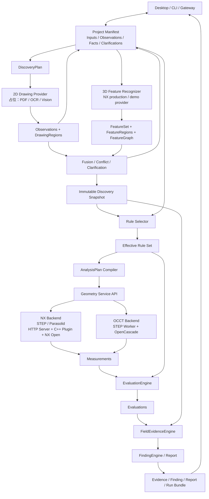

# DFM Hermes Agent 产品目标与研发路线图

本文档只回答四个长期问题：项目要解决什么问题、产品边界是什么、由哪些功能模块组成、
按什么阶段交付和验收。具体接口、代码步骤、测试记录和团队分工由专项文档承接，不在
roadmap 中重复维护。

当前状态：M0–M2.5 已完成，原 M2.6-A 的壁厚/拔模角客观场和公共后处理基线已经完成。
2026-08-11 起，M2.6 按完整产品运行时重新收口为 **DiscoveryPlan → 发现快照 →
AnalysisPlan**：二维信息提取与三维特征发现先于最终规则选择，三维注塑特征识别纳入
M2.6 正式交付；二维图纸识别在 M2.6 建立契约和占位 Provider，具体 OCR/Vision 实现由
M3/M4 并行完成。原壁厚/拔模角基线继续复用，但在新发现契约和真实 NX E2E 完成前不再
视为 M2.6-A 全部完成。

## 1. 项目目标

### 1.1 产品目标

建设一个基于 Hermes 的多工艺 DFM 分析智能体。用户提交产品三维模型、2D 工程图纸或
两者组合后，智能体能够：

1. 建立可恢复的 DFM 项目并管理输入版本；
2. 先提取二维工程观察，用已有图纸信息减少重复询问；
3. 在三维特征识别前确认制造工艺、单位以及识别器声明的其它阻塞事实；
4. 提取三维产品特征/区域并融合二维观察，对缺失、冲突或低置信度条件发起少量、明确的澄清；
5. 冻结发现快照，并根据事实、特征、区域和版本化规则选择需要计算的指标；
6. 调用经过认证的几何或仿真 Backend 产生客观 Measurement；
7. 用确定性规则完成 Evaluation 和 Finding；
8. 输出包含数值、规则、特征、区域、证据、版本和建议的可复核报告；
9. 支持取消、失败恢复、输入升级和受影响分析项重跑。

智能体负责理解、澄清、规划、编排和解释；工程 Backend 负责客观计算；规则引擎负责
确定性评价。LLM 不直接生成壁厚、拔模角、孔隙率、阈值或风险分数。

### 1.2 用户使用闭环

```text
创建/恢复项目
→ 上传产品模型和/或图纸
→ 输入能力预检并执行二维观察提取
→ 第一道澄清：确认工艺、单位等识别前阻塞事实
→ 执行三维特征发现；未实现的识别器显式回落 whole-model ordinary 区域
→ 融合 Observation / Feature / Region
→ 第二道澄清：确认材料、开模方向、冲突和低置信度候选
→ 冻结 Confirmed Facts 与发现快照
→ 选择有效规则和所需指标
→ 生成并确认 AnalysisPlan
→ 调用认证 Backend 计算
→ Evaluation / Finding / Evidence
→ 查看报告、补充资料或重跑
```

完成态不是“Agent 给出了一段看起来合理的回答”，而是每个工程结论都能追溯到：

```text
Input → Observation / Feature / Region → Confirmed Fact → Discovery Snapshot
→ Effective Rule → AnalysisPlan Task
→ Calculator/Backend → Measurement → Evaluation → Finding → Evidence
```

### 1.3 成功标准

项目最终应满足：

- **业务可用**：代表性产品的分析结果达到模具工程师批准的误差、召回和证据要求；
- **结果可信**：定量 Finding 必须同时引用 Measurement 和版本化 Rule；
- **多工艺隔离**：注塑与压铸使用独立事实要求、规则范围和能力声明；
- **多 Backend 一致**：NX 与 OCCT 遵循同一 Measurement 契约，不在 Backend 内评价工艺规则；
- **可恢复**：项目、计划、运行和制品不依赖聊天记录，可从 Manifest 恢复；
- **可扩展**：新增格式、工艺、Calculator 或 OCR Provider 不需要修改 Hermes Agent Loop；
- **不破坏 Hermes**：DFM 是默认关闭的独立 toolset，不扩大无关会话的工具 Schema，保持
  会话内提示词和工具 Schema 稳定；
- **可回归**：PythonOCC demo 与 NX production 走同一客观场契约和后处理流程；允许数值精度不同，但不允许数据流分叉。

## 2. 产品范围与能力边界

### 2.1 工艺范围

| 工艺 | 当前定位 | 近期目标 |
| --- | --- | --- |
| 注塑 `injection` | 壁厚/拔模角统一契约已落地 | PythonOCC 用于 demo 与契约验证，NX 完成认证后用于生产 |
| 压铸 `die_casting` | 已有工艺适配和 STEP 拓扑冒烟 | 在 M2.6-B/C 以同源 STEP/Parasolid 黄金产品逐指标扩展独立规则与生产闭环 |
| 其他工艺 | 不在当前承诺范围 | 复用 ProcessAdapter 和规则范围逐项评估，不共享阈值冒充支持 |

### 2.2 输入与能力矩阵

| 输入 | 当前能力 | 目标能力 | 明确限制 |
| --- | --- | --- | --- |
| STEP/STP 产品模型 | PythonOCC demo 支持壁厚与拔模角客观场 | NX production 直接读取 STEP，并与 Parasolid 使用相同 Objective Task/Result 和 Hermes 后处理链 | PythonOCC 不作为认证 Calculator；生产 NX 不得在失败后自动降级到 PythonOCC |
| Parasolid `.x_t` 产品模型 | 轻量预检和 HTTP NX Client 契约已具备；真实分析未交付 | NX Server + NX C++ Plugin 产生 Measurement | 本地不解析 B-Rep；NX 服务、许可证、格式版本和 Calculator 未认证时必须阻塞 |
| PDF/PNG/JPG 2D 图纸 | 尚未实现生产提取 | OCR、版面、字段和工程特征识别 | 无可靠比例或明确尺寸时不得从像素推断精确几何值 |
| 三维模型 + 2D 图纸 | 尚未实现融合 | 图纸要求与几何测量交叉校验、局部规则应用 | 二维区域映射到三维拓扑有歧义时必须请求确认 |
| 模流/凝固仿真结果 | 尚无 Backend | 后续通过 Simulation Result Backend 或标准结果导入器接入 | 空气压力、卷气、温度、热节和孔隙率不能由单个产品 B-Rep 推导 |

### 2.3 当前不做

- 不建设通用 CAD 查看、编辑、建模或格式转换平台；
- 不自动修改客户产品模型；
- M2.6 不分析完整模具装配、冷却水路或全部模具结构；
- 不把工程师 Ground Truth 发送给 Agent 或写入生产分析；
- 不开发 Ground Truth 自动比较程序，第 21 步由模具工程师人工核对；
- 不为 DFM 重写第二套 Desktop 聊天、附件或会话系统；
- 不在工具调用中自动安装 NX、OpenCascade、OCR 等重型依赖；
- 不把未认证能力、占位结果或 LLM 推断包装成正式 Finding。

## 3. 总体架构与主流程



### 3.1 架构职责

```text
Inputs
→ DiscoveryPlan 先调用二维信息 Provider
→ 汇总图纸事实并确认各 Recognizer 的 required_fact_names
→ 调用三维 Feature Recognizer；不可用的识别器按普通区域回退且不伪造 Feature
→ Observation / Feature / Region 经融合、冲突检测和必要人工确认
→ 冻结 Discovery Snapshot 与 Confirmed Facts
→ RuleSelector 根据工艺、材料、feature.kind、region.role 选择规则
→ Effective Rule Set 描述当前产品每个特征区域需要哪些指标
→ AnalysisPlan Compiler 把指标解析为区域化 Calculator DAG
→ Geometry Backend 只输出 Feature/Region 或 Measurement 等客观结果
→ EvaluationEngine 用规则参数评价 Measurement
→ Evidence/Finding 形成工程问题、特征、区域、证据和建议
```

`DiscoveryPlan` 与 `AnalysisPlan` 是两个持久化阶段，不允许未解析的特征引用进入
AnalysisPlan。不影响识别路线的二维和三维工作可以并行；工艺、单位或方向会改变识别器
语义时必须先通过第一道事实门。最终规则选择必须等待所需发现结果和关键事实
确认完成。模型导入、拓扑索引、网格和特征发现可以缓存复用，修改规则不应重跑这些
客观发现步骤。

### 3.2 必须保持的架构原则

1. **Manifest 是项目事实来源。** 聊天和 memory 只服务对话连续性，不替代项目数据库。
2. **Measurement 与 Evaluation 分离。** NX、OCCT、OCR 或仿真 Backend 不输出最终工艺判断。
3. **规则驱动计划。** 当前产品计算哪些指标由事实和 Effective Rule Set 决定，不由 LLM
   临时选择一组脚本，也不默认运行所有 Calculator。
4. **能力必须认证。** 格式可读取不等于 Calculator 可用；Plan 只能使用 Backend 声明为
   `certified` 的 Calculator。
5. **结果必须可追溯。** Run 固化输入哈希、事实、规则、Plan、Backend、Calculator 和制品版本。
6. **缺失条件显式阻塞。** 使用结构化 `dependency_missing`、`unsupported_capability`、
   `rule_not_found` 等状态，不补假值。
7. **扩展留在边缘。** DFM 使用独立、默认关闭的 toolset；不修改 Hermes Agent Loop，
   不加入 `_HERMES_CORE_TOOLS`。
8. **用户事实与规则分离。** 材料、单位、出模方向属于项目事实；阈值、适用条件和严重程度
   属于版本化规则库。
9. **先发现、后分析。** 二维 Observation 与三维 Feature/Region 先形成不可变发现快照，
   再选择规则和编译 AnalysisPlan；不得在特征未知时猜测局部规则。
10. **Observation 不等于 Fact。** OCR/Vision 结果首先是带页码、bbox、原文和置信度的
    Candidate；只有确认或无歧义解析后才可成为规则输入。
11. **特征识别与规则判断分离。** Recognizer 只回答“是什么、在哪里、客观参数是什么”，
    不输出 pass/fail、severity 或 recommendation。

## 4. 功能模块

| 模块 | 核心职责 | 当前状态 | 下一交付 |
| --- | --- | --- | --- |
| Hermes 接入与对话协调 | `dfm_project`/`dfm_analysis` 工具适配；理解新建、继续、确认、运行和取结果 | 已完成基础闭环 | 保持工具 Schema 稳定，优化当前里程碑用户流程 |
| Project/Manifest | 管理输入、Observations、Facts、Features、Regions、FusionLinks、两阶段 Plans、Runs 和 Artifacts | 基础 Manifest 已完成；发现契约已加入 | 持久化不可变 Discovery Snapshot 和受影响重算关系 |
| Intake/Preflight | 识别 STEP、`.x_t`、图纸输入，完成哈希、安全预检和能力查询 | STEP 可用，`.x_t` 轻量预检完成 | 让 NX capability 同时声明 STEP/Parasolid，并按部署模式选择 production NX 或 demo PythonOCC |
| ProcessAdapter | 隔离注塑/压铸的 required facts、scope 和 capability | 注塑、压铸已拆分 | 完善压铸黄金产品所需事实和规则范围 |
| Clarification/Fact | 提出缺失事实问题并将用户确认写回 Manifest | 基础能力已完成 | 冻结合金、单位、六个出模方向、区域和工艺参数 |
| Rule Repository/Selector | 根据工艺、材料、`feature.kind`、`region.role` 形成 Effective Rule Set | 当前有版本化 scope/规则文件；特征条件未完成 | M2.6 先实现壁厚/拔模角/R 角所需最小特征规则选择；M5/M6 通用化 |
| Discovery/Analysis Plan Compiler | DiscoveryPlan 编排二维/三维发现；AnalysisPlan 编排已解析区域的 Calculator DAG | 单阶段 Plan 基线已完成；新增 phase/snapshot 契约 | M2.6 实现两阶段编译、快照失效和断点复用 |
| Geometry Service | 统一格式、Calculator、Backend 和 certification resolution | 目标边界已确定，正式服务待收敛 | M2.6 贯通 NX；M5 形成 NX/PythonOCC 统一注册与解析接口 |
| PythonOCC Backend | STEP B-Rep 读取，输出壁厚/拔模角 Measurement、ScalarField、RenderScene、TopologyMap | demo 适配层已统一 | 用同一契约验证 NX 链路；保持 `certified=false` |
| NX Backend | STEP/`.x_t` 上传、Job、NX Open、C++ Calculator 和客观 Artifact | HTTP Client/Schema 4 区域任务契约完成；Server、STEP loader 和插件未交付 | M2.6-A 用当前正式 Scope 打通两种格式；之后逐项认证黄金产品 Calculator |
| 3D Feature Recognizer | 从 B-Rep 识别主壁、螺柱、筋、Boss、圆角及其 FeatureRegion/关系 | 契约已加入，识别实现未完成 | M2.6 必须实现并以真实 STEP/Parasolid 验收；NX production 遵守统一契约，MTK 可作为独立 Provider |
| Drawing Observation Provider | 输出带页码、视图、bbox、原文和置信度的二维 Observation，不直接输出 Fact | Analyzer 占位边界存在，具体实现未开始 | M2.6 固定接口和伪代码；M3/M4 实现 PDF/OCR/Vision |
| Fusion/Clarification | 关联二维 Observation 与三维 FeatureRegion，处理冲突、歧义和人工确认 | Fusion 占位边界存在，契约已加入 | M2.6 实现最小冻结/阻塞逻辑；M5 通用化匹配与置信度模型 |
| EvaluationEngine | 使用 Effective Rule Set 对 Measurement 做确定性评价 | 已从所有 Geometry Backend 独立；无旧阈值兼容路径 | M2.6 接入经审核的生产规则 |
| Finding/Reporting | 形成 Finding、Evidence、JSON/Markdown/PPTX 报告和 Artifacts | 已改为后端无关的统一装配 | 支持 NX 黄金产品报告和后续图纸证据 |
| Runtime/Capability | Job 生命周期、取消、超时、外部 Job ID、Artifact 校验和能力状态 | 公共阶段/错误码、Artifact Run 身份与哈希、Operation 客观结果复用已完成；NX Client 契约完成 | 对接 NX Worker、许可证、远端取消/恢复和幂等 |

### 4.1 模块间核心契约

roadmap 只约束以下稳定关系，字段级 Schema 以代码和专项契约文档为准：

| 契约 | 必须包含 |
| --- | --- |
| Project Fact | 名称、值、单位、确认状态、来源和证据；假设不能伪装成 confirmed |
| Observation | 输入、类型、原始/规范化值、单位、页码/bbox/原文等来源、置信度和候选状态 |
| Feature | 输入哈希、稳定 Feature ID、类型、Region 引用、客观属性、关系、Recognizer/版本和置信度 |
| Region | 输入哈希、语义角色、bbox/拓扑引用、版本、内容哈希和来源 |
| FusionLink | Observation、Feature、Region 引用、匹配方法、置信度、歧义/确认状态和诊断 |
| Discovery Snapshot | 输入哈希、Observation/Feature/Region/FusionLink 版本与 Artifact 哈希；冻结后不可原地改写 |
| Effective Rule | Rule ID、版本、适用条件、Metric、Operator、阈值参数、单位、来源和哈希 |
| DiscoveryPlan | `phase=discovery`、输入版本、发现 Calculator/Provider、能力要求和 Feature/Region/Observation 制品 |
| AnalysisPlan | `phase=analysis`、Discovery Snapshot 引用、Metric/Calculator、Feature/Region、参数来源、认证要求和预期制品 |
| Measurement | Calculator、客观值、Feature/Region、单位、质量、诊断、客观场引用和 Backend/版本 provenance |
| Evaluation | Measurement/Feature/Region/Rule 引用、实际值、期望值、Operator、Outcome 和参数来源 |
| Finding | Evaluation/Measurement/Rule/Feature/Region 引用、severity、证据、建议和未解决项 |
| Run Bundle | 输入哈希、Facts、Effective Rules、Plan、Backend/Calculator 版本及全部结果制品引用 |

## 5. 研发计划

### 5.1 里程碑总览

| 里程碑 | 目标结果 | 状态 |
| --- | --- | --- |
| M0 基础架构 | 独立 DFM toolset、项目状态、Analyzer/Run/Artifact 契约贯通 | 已完成 |
| M1/M1.2 STEP 迁移与指标拆解 | 迁移旧 STEP 能力，拆分检查族和 Measurement，固定行为基线 | 已完成 |
| M2 注塑 STEP 端到端 | 上传、澄清、Plan、运行、Finding、Evidence 和报告完整闭环 | 已完成 |
| M2.5 多工艺/多格式适配 | 注塑与压铸隔离；STEP 与 `.x_t` 输入分离；NX HTTP Backend 契约 | 已完成 |
| M2.6 发现驱动的 NX 黄金产品闭环 | A：新运行时架构/契约、三维特征识别与当前 Scope；B：特征区域规则及指标逐项扩展；C：黄金产品全范围验收 | 原客观场基线完成；两阶段 Plan、三维识别与真实 NX 待完成 |
| M3 图纸文本理解 | 从 PDF/图片提取可追溯字段和指标要求 | 未开始，可并行准备 |
| M4 二维工程 Observation 识别 | 识别螺牙、孔、筋、油路、局部视图及图纸区域，输出候选 Observation | M2.6 只做契约/占位，具体实现未开始 |
| M5 通用融合与计划编排 | 将 M2.6 的最小 Fusion/RuleSelector/两阶段 Plan 通用化到更多输入和工艺 | 未开始 |
| M6 规则库与确定性评价 | 规则审核/发布/版本管理、完整 Evaluation/Finding 体系 | 未开始 |
| M7 产品化与发布 | 混合输入、Desktop 辅助视图、全链路验收、部署和维护 | 未开始 |

### 5.2 已交付基线（M0–M2.5）

- 注塑 STEP 已支持项目、持久化澄清、Plan、后台 Run、取消、Finding、Artifacts 和报告；
- STEP Worker 已改为 PythonOCC demo Geometry Backend，只输出客观 Measurement 与中立场；
- PythonOCC/NX 共用 ObjectiveResult 校验、EvaluationEngine、FieldEvidenceEngine、evaluated Finding 和报告装配；
- 注塑与压铸具有独立 ProcessAdapter、required facts 和 scope；
- `.x_t` 只做 opaque preflight，真实分析固定走 `HttpNXBackendClient`，没有本地脚本兜底；
- NX Backend 已定义 capability、上传、Job、取消、结果和 Artifact 契约；
- 未配置 NX 服务时明确返回依赖/健康状态；PythonOCC STEP demo 仍可独立运行，但 NX production 的 STEP/Parasolid 不得借此降级；
- 当前冻结候选的 DFM 回归基线为 141 passed，并通过真实 PythonOCC STEP E2E；真实 NX E2E 仍是生产发布门。

详细记录：

- [M2 STEP 端到端实施记录](2026-07-21-dfm-m2-end-to-end.md)
- [M2.5 多工艺与多格式实施计划](2026-07-22-dfm-m25-multi-process-geometry.md)

### 5.3 M2.6：NX 黄金产品 DFM 纵向闭环

#### 目标

M2.6 不要求一次实现黄金产品全部指标。它先复用当前冻结的正式 Scope 完成每个生产模块，
再按“一个指标/区域范围一个可验收增量”扩展，最终使真实或脱敏黄金产品的指标、问题、
区域和证据在批准误差内与工程师基线一致。

Topology 冒烟只能证明 NX 可以打开模型，不能代表任何阶段完成。每个阶段都必须贯通：

```text
STEP 或 Parasolid + Confirmed Facts
→ Effective Rule Set
→ Product Plan
→ NX Server / NX C++ Calculators
→ ObjectiveResultManifest + 客观几何 Artifacts
→ Hermes EvaluationEngine
→ Finding / Evidence / Report
→ immutable Run Bundle
```

#### M2.6-A：发现驱动架构、三维特征识别与当前 Scope

第一阶段继续使用当前冻结的 `injection.wall-draft@3.0.0`：ABS、mm、一个确认开模方向、
壁厚和拔模角两个指标，同时把运行时改为 DiscoveryPlan/AnalysisPlan，并实际交付三维
注塑特征识别。目标不是一次覆盖全部特征规则，而是先冻结可复用的数据流和模块职责：

```text
Intake
→ DiscoveryPlan
→ 2D Observation 占位 + 3D Feature Recognizer 实际执行
→ FeatureSet / FeatureRegion / FeatureGraph
→ Fusion / Clarification / Confirmed Facts
→ immutable Discovery Snapshot
→ RuleSelector / AnalysisPlan
→ NX Calculator / Objective Field
→ Evaluation / Evidence / Finding / Report
```

- 三维 Recognizer 首批必须识别并返回可定位 Region 的 `main_wall`、`screw_boss`、`rib`、
  `boss` 和 `fillet`；识别不到或置信度不足时明确返回 `needs_confirmation`，不伪造特征；
- NX production 必须对 STEP/Parasolid 输出同一 Feature/Region 契约；MTK 可作为独立
  Provider 或识别算法加速器，但其内部 ID 不能成为 Hermes 稳定 ID；
- PythonOCC demo 允许只覆盖经声明的特征子集，但必须使用同一正式契约并标记
  `certified=false`；
- 二维 Provider 在本阶段只固定 Observation 契约、能力状态和以下占位逻辑，不产生正式
  OCR/Vision 结论：`render_pages → extract_text/OCR → detect_callouts → emit candidates`；
- Observation 不能直接成为 Rule 输入；必须经过 Fusion、冲突检测和确认；
- 当前模型-only Run 在无二维输入时可以由三维发现和用户确认事实继续，不被占位 Provider
  阻塞。

在此基础上继续完成 Intake、Backend resolution、NX Server/Worker、壁厚/拔模角客观场、
规则引擎、三视角证据、Finding、报告和断点复用。

- NX 必须同时接受 STEP/STP 和 Parasolid `.x_t`，Capability 分格式声明支持与认证范围；
- 优先使用同一 CAD 源导出的 STEP/Parasolid 配对样件，验证两种输入经过 NX 后实现同一
  Objective Task/Result 契约；
- production 模式的 STEP 和 Parasolid 都走 NX；PythonOCC 只在 demo 模式处理 STEP，NX
  不可用时明确失败，不自动降级；
- Hermes 已冻结的 Scope、Evaluation、Evidence、Finding 和报告链直接复用，不在 NX 中
  重写规则或截图；
- 本阶段完成标准是两个格式的真实 NX 端到端、壁厚/拔模角 Calculator 认证和可复核
  Run Bundle，不要求黄金产品全部指标完成。

当前状态：Task/Result Schema 4、PythonOCC 区域客观场验证链和公共后处理已完成；Feature、
Observation、FusionLink、Feature/Region 回链和 Plan phase 已加入契约。两阶段编译器、真实
三维 Recognizer、NX Server、STEP/Parasolid loader、真实 Calculator 和配对 E2E 待交付。

#### M2.6-B：黄金产品指标逐项扩展

第二阶段先完成注塑特征区域规则：主壁、螺柱、筋和 Boss 分别选择壁厚/拔模角规则，根部
圆角使用 `measure_fillet_radius` / `fillet_radius_mm`，并让 RuleBinding、Measurement、
Evaluation、Evidence 和 Finding 全部回链 Feature/Region。随后再按黄金产品追溯矩阵增加
倒扣、投影面积等指标；如黄金产品包含压铸，则另建经工程审批的压铸 Scope/RuleBinding，
不得复制注塑阈值。

每增加一项都必须独立完成：

```text
Observation/Feature/Region → Confirmed Fact → Rule → AnalysisPlan Operation
→ NX Measurement/Field → Hermes Evaluation/Evidence/Finding/Report
```

并通过真实样件回归；不先堆完全部 Calculator 再统一集成。

#### M2.6-C：黄金产品完整范围与工程验收

第三阶段要求黄金产品范围内已批准指标覆盖率达到 100%，执行真实 NX 生产 Run，生成
不可变 Run Bundle，由模具工程师按批准容差、问题区域和证据逐项核对并签字。只有这一
阶段通过后，才能声明“M2.6 NX 黄金产品第一条真实 DFM 纵向闭环完成”。

温度、速度、空气压力、卷气、热节和孔隙率属于模流/凝固仿真结果，不由本轮 NX B-Rep
Calculator 推导；它们登记为后续 Simulation Result Backend 候选。

详细计划见 [M2.6 NX 黄金产品实施计划](2026-07-28-dfm-m26-nx-golden-product.md)。

### 5.4 M3：2D 图纸文本理解

**目标：** 从 PDF、PNG、JPG 中提取材料、单位、尺寸、公差、表面处理和技术说明，并
保留页码、bbox、原文、规范化值和置信度。M3 是运行时 Discovery 的输入理解 Provider，
不是几何计算之后的报告增强步骤。

主要交付：页面渲染、原生 PDF 文本、OCR Provider、版面/标题栏解析、字段字典、标注
语料、冲突检测、澄清和确认写回。仅图纸输入不得触发缺少几何条件的精确计算。

### 5.5 M4：2D 工程特征识别

**目标：** 识别影响局部 DFM 规则的螺牙、油路/油管、孔、筋、凸台、密封区、剖视图
和局部详图，并输出 Observation 类别、页面、视图、bbox、原文和置信度。输出首先是
Candidate，不直接成为 Fact、Feature 或 Rule。

主要交付：标注规范、代表性语料、模型/规则基线、跨视图关联和低置信度人工确认。
运行时与 M3 一起位于 Fusion/RuleSelector/AnalysisPlan 之前；研发可与 M2.6 NX 主线并行，
但混合输入的生产 AnalysisPlan 不得绕过所需二维 Observation。

### 5.6 M5：事实融合、规则选择与计划编排

**目标：** 将 M2.6 已交付的最小 Fusion/RuleSelector/两阶段 Plan 通用化，根据二维
Observation、三维 Feature/Region 和已确认事实选择正确规则，生成最小、可执行的
Calculator DAG。

主要交付：

- 二维 Observation 与三维 Feature/Region 的带置信度关联；
- `RuleSelector` 和带版本/来源/优先级/哈希的 `EffectiveRuleSet`；
- 格式无关的稳定 Metric/Calculator ID；
- `PlanCompiler` 对参数来源、依赖和认证 Backend 的解析；
- 正式 `GeometryService`、`GeometryBackend` 和 Registry；
- NX/PythonOCC Measurement-only、ScalarField、RenderScene、TopologyMap 一致性。

### 5.7 M6：规则库管理与确定性评价

**目标：** 将工程知识形成可审核、可发布、可回滚、不可变版本的注塑/压铸规则库，并
以统一 Evaluation/Finding 契约输出风险。

主要交付：RuleRepository 草稿/审核/发布、适用条件与覆盖关系、单位和参数校验、规则管理
后台契约、Evaluation provenance、严重程度和 `rule_not_found` 等明确状态。遗留 Worker
阈值兼容提示在规则迁移完成后移除。

### 5.8 M7：混合输入和产品化发布

**目标：** 完成模型-only、图纸-only 和混合输入的用户闭环、发布验收与运维准备。

主要交付：事实融合 E2E、项目/运行版本对比、结构化报告、Desktop 项目状态/Finding/证据
辅助视图（如确有价值）、大型文件安全传输、安装配置、监控、故障排查、依赖和许可证清单。
Desktop 增强不能重写主聊天或形成第二个会话状态源。

## 6. 测试与验收

### 6.1 全阶段不变量

- 定量结论只能来自确定性 Measurement 和 Rule；
- Backend 不产生最终工艺 Evaluation 或 severity；
- 找不到规则、事实或 Calculator 时明确阻塞，不猜测；
- 每个 Run 使用已持久化的输入、事实、规则和 Plan 快照；
- 相同版本组合重复运行应得到工程等价结果；
- 用户确认写回 Manifest，并关闭对应 clarification；
- 历史 Run 不因当前工艺、规则或输入变化被改写；
- 注塑和压铸不能引用彼此的阈值；
- 未配置 NX/OCR 不影响已可用的 PythonOCC STEP demo；选择 NX production 的 STEP/Parasolid 必须明确阻塞，不自动降级；
- Ground Truth 和人工验收结果不进入 Agent 生产执行。

### 6.2 验收层级

| 层级 | 重点 |
| --- | --- |
| 契约/单元 | Schema、状态迁移、单位、规则运算符、参数来源和错误码 |
| Backend | 真实文件、真实导入、Calculator 数值/区域、取消、超时和崩溃恢复 |
| 领域集成 | Fact → Rule → Plan → Measurement → Evaluation → Finding 完整关系 |
| E2E | Desktop/CLI 上传、澄清、运行、进度、Artifacts、报告和恢复 |
| 黄金产品 | 与工程师基线逐项人工核对，记录差异并签字 |
| 回归/隔离 | 注塑 STEP 无回归；工艺、格式、项目和历史 Run 互不污染 |

每个里程碑的数值误差、识别精度和性能阈值由对应代表性语料和工程师评审冻结，roadmap
不写未经验证的统一百分比目标。

## 7. 主要风险与控制

| 风险 | 控制措施 |
| --- | --- |
| 黄金产品报告与 `.x_t` 不是同一版本 | 冻结输入哈希、图纸/报告版本和工程师基线后再开发 Calculator |
| 工程阈值或公式存在歧义 | 先进入澄清和候选清单；工程师批准后才能发布 Rule |
| NX 能打开文件但 Calculator 语义不一致 | capability 按格式、NX 版本、Calculator 和认证范围声明；真实产品验收 |
| LLM 或 Backend 越权做工程判断 | Measurement/Evaluation 分离；Finding 验证器要求完整引用链 |
| 新工艺污染注塑基线 | ProcessAdapter、Rule scope 和 E2E 回归三重隔离 |
| 图纸字段/特征看似合理但位置错误 | 强制页码、bbox、原文和置信度；关键低置信度结果人工确认 |
| 二维特征无法可靠映射三维区域 | 保留候选、置信度和未解决状态，不强制唯一映射 |
| 重型依赖或远程服务影响 Hermes | 子进程/HTTP 隔离、超时、取消、健康状态和默认关闭 toolset |
| Ground Truth 泄露到生产分析 | 验收发生在 Run 完成后，仅人工核对，不向 Agent 或 Backend 提供答案 |

## 8. 当前行动项

### M2.6 主线

1. 联合评审 Observation、Feature、Region、FusionLink、Discovery Snapshot 与 Feature-aware
   Measurement/Evidence/Finding Schema；
2. 选择同源 STEP/Parasolid 配对样件，冻结 SHA256、mm、ABS 和一个开模方向；
3. 实现 DiscoveryPlan/AnalysisPlan 编译、快照冻结、失效传播与 Operation 断点复用；
4. NX 团队让 Server/Worker 同时读取 STEP 与 Parasolid，实现并认证三维注塑 Feature
   Recognizer，以及 topology、壁厚和拔模角；
5. 以 `injection.wall-draft@3.0.0` 跑通真实 NX → Hermes Evaluation/Evidence/Finding/Report，
   完成 M2.6-A；
6. 增加主壁/螺柱/筋/Boss 的区域化壁厚与拔模规则，并增加根部 R 角 Calculator；
7. 由模具工程师冻结最终黄金产品、报告、工艺、材料/合金、方向、FeatureRegion 和完整
   指标追溯矩阵；
8. 需要压铸时建立独立压铸 Scope/RuleBinding，按一个指标一个闭环逐项增加 Calculator；
9. 解决锁模力公式、投影面积来源及设备吨位等业务问题，不让未澄清指标进入 AnalysisPlan；
10. 黄金产品全部批准指标完成后执行只读 Run Bundle 人工核对和签字，完成 M2.6-C；
11. 每次合入都执行 PythonOCC demo 回归和已认证 NX 格式/Recognizer/Calculator 回归。

### M3/M4 二维 Provider 并行准备

OCR 负责人可并行盘点 PDF 页面渲染、原生文本、OCR Provider、字段字典、脱敏图纸和标注
方案。M2.6 必须保留正式 Observation/Fusion 接口和明确的 `not_implemented` 能力状态；
模型-only 的 M2.6 NX 主线不被二维实现阻塞，依赖图纸事实的混合输入 AnalysisPlan 必须
阻塞到所需 Observation 已提取并确认。

## 9. 相关文档

| 文档 | 用途 |
| --- | --- |
| [DFM 分析运行手册](../dfm-analysis-runbook.md) | 当前已实现行为、数据目录和故障排查 |
| [M2 STEP 端到端实施记录](2026-07-21-dfm-m2-end-to-end.md) | M2 交付与验收证据 |
| [M2.5 多工艺与多格式实施计划](2026-07-22-dfm-m25-multi-process-geometry.md) | Process/Format/Backend 拆分设计 |
| [M2.6 NX 黄金产品实施计划](2026-07-28-dfm-m26-nx-golden-product.md) | 当前主线的详细工作包和完成标准 |
| [黄金产品候选指标清单](2026-07-28-dfm-golden-product-metric-candidates-11661116-07.md) | 工程师报告提取的指标、阈值和澄清项 |
| [NX HTTP Backend 契约](2026-07-23-dfm-nx-http-backend-contract.md) | Hermes 与 NX Server 的紧凑接口 |
| [NX Server/C++ 插件开发规格](2026-07-23-nx-server-plugin-development-spec.md) | NX 团队的模块、接口、契约和验收内容 |
| [团队架构与分工](2026-07-23-dfm-team-architecture-and-ownership.md) | 角色边界、模块 Owner 和协作节奏 |
| [DFM/NX Production Task Contract](../dfm-nx-task-contract.md) | M2.6 稳定 ID、任务参数、Capability、Region 和 Measurement 约定 |
| [壁厚/拔模角当前版本冻结说明](2026-08-06-dfm-wall-draft-v2-freeze.md) | Hermes 冻结边界、已完成收口和真实 NX/配对 Golden Model 发布门 |

## 10. 文档维护规则

- 本文只维护产品目标、范围、模块、里程碑、验收和当前行动；
- 具体字段 Schema 以代码和契约文档为准，不在本文复制大段 JSON；
- 具体目录、命令、配置和排障放入运行手册；
- 具体代码任务、接口明细和测试记录放入对应里程碑专项文档；
- 已完成里程碑在本文只保留结果、状态和证据链接；
- 规则阈值存入版本化规则或候选指标清单，不以 roadmap 代替规则库；
- 里程碑目标、模块边界或优先级变化时更新本文的对应章节和 `updated` 日期。
