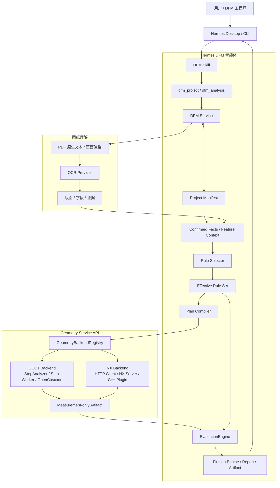

# DFM 分析智能体整体方案、模块划分与团队分工

> 用途：团队启动会、架构同步、任务认领、迭代计划和跨模块验收
> 团队基线：6 人；如果实际为 5 人，按本文“5 人合并方案”合并角色
> 当前阶段：M2.5 已完成；优先推进 M2.6 NX 黄金产品闭环，M3 图纸文本理解并行准备

## 1. 这次同步要达成什么

团队成员在会议结束时应能回答：

1. DFM 智能体最终为用户解决什么问题；
2. STEP、`.x_t`、2D 图纸分别提供什么信息；
3. Hermes、DFM 领域层、NX Server、NX C++ 插件、OCR 分别负责什么；
4. 为什么几何计算和工艺规则必须分开；
5. 自己负责的模块、输入、输出、依赖和完成标准是什么；
6. 跨团队接口发生变化时找谁评审；
7. 哪些能力已经可用，哪些仍然只是 capability/协议边界。

## 2. 产品目标

用户上传产品零件资料，例如：

- STEP/STP 产品三维模型；
- Parasolid `.x_t` 产品三维模型；
- PDF/PNG/JPG 2D 工程图；
- 用户补充的材料、单位、拔模方向和制造工艺。

用户提出问题：

> 这个壳体是否适合压铸？请检查模型完整性、壁厚、拔模角和倒扣，并说明每个风险的
> 实际测量、适用规则和证据位置。

智能体需要完成：

```text
输入登记
→ 格式和能力预检
→ 关键事实澄清
→ 按注塑/压铸生成最小分析计划
→ 调用确定性几何计算
→ 根据版本化规则评价
→ 输出 Measurement / Evaluation / Finding / Evidence / Report
```

核心原则：

- LLM 负责理解、编排、澄清和解释，不生成工程测量值；
- OpenCascade/NX/OCR 等工具负责确定性读取和计算；
- 工艺规则负责判断测量结果是否满足要求；
- 每个结论必须可回溯到输入、算法版本、测量和规则版本；
- 项目 Manifest 是事实来源，聊天记录不是工程数据库。

## 3. 当前能力和下一阶段


| 组合                   | 当前状态                                                   | 下一步                                             |
| ------------------------ | ------------------------------------------------------------ | ---------------------------------------------------- |
| 注塑 + STEP            | M1/M2 完整分析路径可用                                     | 保持回归稳定，逐步抽取通用 B-Rep calculator        |
| 压铸 + STEP            | M2.5 拓扑有效性门可用                                      | 增加压铸 draft/thickness/undercut 等独立规则和计算 |
| 注塑/压铸 +`.x_t`      | Hermes HTTP NX Client 和协议已完成，真实 Server/插件未完成 | NX 团队实现 Server、Worker Pool 和插件 calculator  |
| 2D 图纸                | 可登记，真实文本理解尚未完成                               | M3 原生 PDF 文本、OCR、版面、字段和澄清闭环        |
| STEP/`.x_t` + 图纸融合 | 尚未形成生产闭环                                           | M5 做事实融合和二维区域到三维拓扑关联              |

## 4. 整体架构



其中 Rule Selector 在几何执行前决定适用规则和所需指标；Geometry Service 只生成
Measurement；EvaluationEngine 在几何执行后使用 Effective Rule Set 生成独立
Evaluation，最后由 Finding Engine 形成风险和报告。

## 5. 主流程讲解

### 5.1 STEP 注塑/压铸

```text
上传 STEP
→ STEP Preflight
→ 确认 process
→ ProcessAdapter 返回 required_facts
→ 用户确认材料/单位/拔模方向等事实
→ 编译版本化 Plan
→ StepAnalyzer 启动隔离 OCC Worker
→ 输出 Measurement
→ 按 injection 或 die_casting 规则 Evaluation
→ Finding / Evidence / Report
```

注塑和压铸可以复用客观几何测量，但不得复用未经批准的工艺阈值。

### 5.2 `.x_t` 远程 NX 分析

```text
上传 x_t
→ inspect_parasolid_xt 只做本地轻量预检
→ format_id=parasolid_xt，geometry_verified=false
→ 查询 NX Server capability
→ 检查 Plan 所需 calculator 是否 certified
→ HttpNXBackendClient 流式上传文件
→ NX Server 排队和分配许可证/NX Worker
→ C++ Plugin 读取真实 Parasolid B-Rep 并计算
→ Server 发布 Measurement/Artifact
→ Hermes 校验大小和 SHA-256
→ Evaluation / Finding
```

Hermes 不提供本地 NX 脚本 fallback。NX Server 未配置或 calculator 未认证时，Plan 必须
明确 blocked。

### 5.3 2D 图纸 M3

```text
上传 PDF/PNG/JPG
→ 文件和页数预检
→ PDF 原生文本优先
→ 无可靠文本层时页面渲染 + OCR
→ 标题栏/技术要求/表格等版面识别
→ 提取材料、单位、标称壁厚、公差、表面要求
→ 保存原文、页码、bbox、置信度
→ 冲突或低置信度字段通过 clarify 让用户确认
→ 写入项目 Fact
```

OCR 结果是候选证据，不是自动确认的工程事实；仅图纸输入不能伪造精确三维测量。

## 6. 六人团队角色设计

下面用角色代号代替姓名，启动会后将姓名填入“实际负责人”。六人基线假设你是三名
Python/智能体开发者之一，同时担任总体负责人。


| 角色                             | 建议人数 | 技术栈                              | 实际负责人 | 主责                                                                         |
| ---------------------------------- | ---------: | ------------------------------------- | ------------ | ------------------------------------------------------------------------------ |
| A：总体架构/主流程负责人         |        1 | Python、Hermes、DFM 领域            | 你         | 产品边界、总体架构、主流程、契约审批、跨模块决策和最终验收                   |
| B：DFM 领域平台负责人            |        1 | Python                              | 待填写     | Manifest、ProcessAdapter、Plan、Measurement/Evaluation/Finding、规则和状态机 |
| C：Hermes 集成与质量负责人       |        1 | Python、Hermes、Desktop/Django 经验 | 待填写     | 工具/Skill、Desktop 闭环、配置部署、E2E、回归和联调环境                      |
| D：NX Server/Runtime 负责人      |        1 | C++、Windows、服务开发              | 待填写     | HTTP Server、上传、Job、Worker Pool、许可证、取消、结果和部署                |
| E：NX C++ 插件/Calculator 负责人 |        1 | C++、NX Open/UFUN                   | 待填写     | 插件桥、模型加载、几何索引、calculator、证据和数值认证                       |
| F：图纸理解/OCR 负责人           |        1 | OCR、CV、模型训练、Python           | 待填写     | PDF/OCR、版面、字段提取、标注语料、指标评估和 M3 闭环                        |

### 6.1 如果实际只有 5 人

优先合并：

```text
B：DFM 领域平台
C：Hermes 集成与质量
```

合并为一名 Python 领域/集成负责人；不要合并 NX Server 和插件为唯一责任人后又要求其
同时承担所有几何算法，二者工作量和故障域都较大。OCR 负责人可在 M3 启动前部分时间
协助测试数据、图纸语料和工程字段定义。

### 6.2 如果你不占三名 Python 开发名额

可增加：


| 角色                    | 主责                                                          |
| ------------------------- | --------------------------------------------------------------- |
| G：规则与几何认证负责人 | 压铸规则库、CalculatorDefinition、STEP/x_t 差分语料和数值认证 |

否则这部分由 A+B 共同负责，A 对规则来源和认证结论最终签字。

## 7. 第一层分工表


| 工作域                  | A 总体架构 | B 领域平台       | C Hermes/质量   | D NX Server     | E NX 插件        | F OCR        |
| ------------------------- | ------------ | ------------------ | ----------------- | ----------------- | ------------------ | -------------- |
| 产品范围和路线图        | 主责       | 参与             | 参与            | 知会            | 知会             | 参与         |
| 总体架构和主流程        | 主责/审批  | 参与             | 参与            | 参与            | 参与             | 参与         |
| 跨模块数据契约          | 审批       | 主责             | 评审            | 评审            | 评审             | 评审         |
| Project/Manifest        | 审批       | 主责             | 测试            | 知会            | 知会             | 接入         |
| ProcessAdapter/Plan     | 审批       | 主责             | 测试            | 提供 capability | 提供 capability  | 提供字段能力 |
| 规则/Evaluation/Finding | 审批       | 主责             | E2E             | 不负责          | 提供 Measurement | 提供图纸事实 |
| HTTP NX Client          | 架构       | 参与             | 主责联调        | 对接            | 知会             | 无           |
| NX Server               | 架构审批   | 提供契约         | 联调            | 主责            | 参与             | 无           |
| NX Worker/许可证        | 评审       | 知会             | 故障测试        | 主责            | 参与             | 无           |
| NX C++ 插件框架         | 评审       | 契约评审         | E2E             | 参与            | 主责             | 无           |
| NX calculator           | 规则审批   | Measurement 契约 | 差分测试        | 运行环境        | 主责             | 无           |
| STEP/OCC 回归           | 评审       | 主责             | 主责 E2E        | 无              | 对照样件         | 无           |
| PDF/OCR/版面            | 架构审批   | Fact 接口        | Hermes 接入/E2E | 无              | 无               | 主责         |
| 标注语料与模型指标      | 规则审批   | 字段评审         | 数据流水线      | 无              | 无               | 主责         |
| Desktop 用户闭环        | 体验审批   | API 支持         | 主责            | 无              | 无               | 参与         |
| 部署/配置/运维          | 审批       | DFM 配置         | 主责 Hermes 侧  | 主责 NX 侧      | 插件安装         | OCR 依赖     |
| 发布验收                | 最终负责   | 领域验收         | 测试证据        | Server 验收     | 数值验收         | OCR 指标验收 |

“主责”表示实现、测试、文档和问题闭环都由该角色推动；“审批”不等于代写代码。

## 8. 各角色的聚焦模块

### 8.1 A：总体架构/主流程负责人

负责：

- 维护长期路线图和里程碑范围；
- 确定用户场景和能力边界；
- 主持架构、数据契约和跨模块评审；
- 决定工艺/格式/calculator capability 组合语义；
- 审批注塑/压铸规则来源和优先级；
- 维护“不做什么”和防止范围扩张；
- 组织真实 E2E 和里程碑验收；
- 协调 NX、智能体、OCR 三条线的依赖。

不建议长期承担：

- 替每个模块补所有实现细节；
- 成为唯一测试人；
- 直接维护每个 NX calculator；
- 在接口未评审时接受临时字段扩散。

主要交付：路线图、架构决策记录、接口审批、里程碑验收报告和团队优先级。

### 8.2 B：DFM 领域平台负责人

负责模块：

```text
tools/dfm/contracts.py
tools/dfm/service.py
tools/dfm/processes/
tools/dfm/scopes/
tools/dfm/findings.py
tools/dfm/project/
```

需求和能力：

- Project/Input/Fact/Clarification/Plan/Run/Measurement/Finding 契约；
- 工艺选择和 required_facts；
- 注塑/压铸 scope、规则隔离和 provenance；
- Plan 失效、输入版本和增量重规划；
- backend/calculator capability 解析；
- NX Measurement 的结构和语义校验；
- 规则匹配、Evaluation 和 Finding；
- 向 OCR 字段提供 Fact 写入和冲突接口。

完成标准：单元/集成测试、旧 Manifest 兼容、注塑无回归、契约文档同步。

### 8.3 C：Hermes 集成与质量负责人

负责模块：

```text
tools/dfm_tool.py
skills/manufacturing/dfm-analysis/
tools/dfm/backends/nx/client.py
apps/desktop 现有 clarify/Artifacts 集成验证
tests/tools/dfm/e2e
部署和 runbook
```

需求和能力：

- 保持 `dfm` 独立 toolset 和稳定 Schema；
- Agent 正确选择工艺、保存 run_id、使用 clarify；
- HttpNXBackendClient 上传、提交、轮询、取消、下载和哈希；
- Desktop 进度、表单、Artifact 和报告打开；
- NX Server Fake/真实联调；
- OCC、NX、OCR 故障隔离和 E2E；
- config.yaml、密钥和部署文档；
- 完整回归、Ruff、Schema 和运行手册。

完成标准：用户场景自动化 E2E、错误可诊断、没有第二套聊天页面、不破坏 Prompt Cache。

### 8.4 D：NX Server/Runtime 负责人

负责模块：

```text
NX HTTP API
Input Store
Job Queue/State Machine
License Scheduler
NX Worker Pool
Cancellation/Timeout
Artifact Store
Windows Service/Deployment
```

需求和接口以
[NX Server 与 NX C++ 插件开发交接规格](2026-07-23-nx-server-plugin-development-spec.md)
为准。

第一阶段聚焦：

- `/v1/capabilities`；
- 输入 reservation 和流式上传；
- Job 提交/查询/取消/结果/Artifact；
- Mock Worker；
- 一个真实 NX Worker；
- `inspect_topology` 垂直链路；
- 许可证、崩溃、超时和清理。

完成标准：API 契约测试、并发/安全测试、真实 Hermes E2E、部署/回滚文档。

### 8.5 E：NX C++ 插件/Calculator 负责人

负责模块：

```text
RequestParser/Validator
PartLoader
GeometryIndex
CalculatorRegistry
IDfmCalculator
Topology/Draft/Thickness/Undercut
Progress/Cancellation
Measurement/Artifact Writer
NX Session Cleanup
```

第一阶段聚焦：

- 将现有插件算法从 UI/菜单入口抽成可调用 calculator；
- 实现白名单 dispatcher；
- 加载 `.x_t` 并识别单位、Body 类型和版本；
- 实现 `inspect_topology`；
- 输出标准 measurements.json；
- 支持取消安全点和进度；
- 证明 Part/NX 对象可以清理并重复运行。

第二阶段：按 draft → thickness → undercut 顺序开发，每项独立认证。

完成标准：相同输入和版本结果可重复、Schema 合法、无任意代码执行、数值认证报告通过。

### 8.6 F：图纸理解/OCR 负责人

负责模块建议：

```text
tools/dfm/drawing/preflight.py
tools/dfm/drawing/render.py
tools/dfm/drawing/native_text.py
tools/dfm/drawing/providers/
tools/dfm/drawing/layout.py
tools/dfm/drawing/normalization.py
tools/dfm/drawing/conflicts.py
tests/fixtures/dfm/drawings/
```

需求和能力：

- PDF 原生文本优先，OCR 作为扫描页/图片 fallback；
- 中英文、旋转、低分辨率和多页图纸；
- 标题栏、技术说明和表格区域；
- 材料、单位、标称壁厚、公差、表面处理等字段；
- 原文、页码、bbox、置信度和证据图；
- 候选字段与已确认 Fact 分层；
- 冲突/低置信度结果进入用户澄清；
- 标注语料、字段级 precision/recall 和数值准确率。

完成标准：代表性脱敏语料达到评审阈值，关键低置信度值不会静默成为确认事实。

## 9. 模块接口表


| 提供方           | 消费方      | 接口/产物                                             | 负责人   |
| ------------------ | ------------- | ------------------------------------------------------- | ---------- |
| Hermes Intake    | DFM Service | InputRecord、sha256、format_id                        | B/C      |
| Confirmed Facts  | Rule Selector | process、material、feature、customer context        | B/F      |
| Rule Selector    | Effective Rule Set | rule id/version/source/priority/hash             | B        |
| Effective Rule Set | Plan Compiler | required metrics、parameters、scope snapshot        | B        |
| Plan Compiler    | Geometry Service | calculator DAG、backend requirements、input hash   | B → C/D |
| NX Server        | Hermes      | capability、JobStatus、Artifact manifest              | D → C   |
| NX 插件          | NX Server   | plugin result、Measurement、evidence                  | E → D   |
| NX/OCCT Backend  | EvaluationEngine | Measurement-only Artifact                        | B/E      |
| Effective Rule Set | EvaluationEngine | operator、expected、unit、provenance              | B        |
| EvaluationEngine | Finding Engine | evaluations.json、rule_ref、provenance               | B        |
| Finding Engine   | Reporting   | Finding、Evidence、Report                              | B/C      |
| OCR Pipeline     | Manifest    | ExtractedField、evidence、Fact candidate              | F → B   |
| Hermes clarify   | 用户        | clarification + candidates + evidence                 | C        |
| 用户确认         | Manifest    | confirmed Fact                                        | B/C      |
| Finding/Artifact | Desktop     | 结构化结果和路径                                      | C        |

任何接口变更必须：提供方提出、消费方评审、A 审批、测试和文档同一变更完成。

## 10. 推荐并行开发计划

### Sprint 0：团队对齐和契约冻结


| 角色 | 工作                                                 |
| ------ | ------------------------------------------------------ |
| A    | 讲解本文，确认范围、负责人、第一批样件和验收标准     |
| B    | 冻结 Measurement/Plan/规则接口，提供 NX/OCR 示例数据 |
| C    | 提供 FakeNXClient、Hermes 联调环境和 E2E 脚本        |
| D    | 评审 HTTP v1，输出 Server 技术方案和部署前提         |
| E    | 盘点现有 C++ 插件、NX API、许可证和可抽取 calculator |
| F    | 盘点图纸样本、字段字典、OCR 基线和标注需求           |

Sprint 0 必须以 [DFM/NX Task Contract v2](../dfm-nx-task-contract-v2.md) 为单一事实源，
完成 Rule/Metric/Calculator/Operation/Measurement/Region ID 词典、任务级参数、结构化
capability、Measurement 回链、v1/v2 兼容矩阵和 Hermes/NX 共用 JSON fixtures。仅开会确认
概念或分别维护 Python/C++ 示例不视为完成。

### Sprint 1：黄金产品冻结与两条最小链路

NX 线：

```text
x_t 上传 → Mock Job → 真实 NX 打开 → inspect_topology → measurements.json
```

同时由模具工程师和 A/B/E 冻结黄金产品事实、所需指标、问题、规则、区域、容差和追溯
矩阵。Topology 是中间冒烟，不是 M2.6 完成标准。

OCR 线：

```text
PDF/图片 → 页面 → 原生文本/OCR TextBlock → 材料/单位候选 + bbox
```

Python 线同时完善契约校验和 Hermes E2E。

### Sprint 2：黄金产品所需 calculator 与生产闭环

- NX topology 及黄金产品所需 draft/thickness/undercut 等 calculator 逐项认证；
- 完成压铸 `.x_t` 的 Fact → Rule/Plan → NX → Measurement → Evaluation → Finding → Report；
- OCR 关键字段澄清/确认写回；
- NX 取消、超时、崩溃和 Artifact 校验；
- 图纸冲突、低置信度和证据展示；
- 注塑 STEP 完整回归。

### Sprint 3：人工核对和工程师签字

- 从完成的生产 Run 形成只读 Run Bundle；
- 模具工程师使用既有分析基线逐项人工核对指标、数值、Finding、区域和证据；
- 记录每项差异、原因、处理结论和批准人，不开发自动比较程序；
- 修正可解释差异，模具工程师完成签字；
- M2.6 通过后再扩大产品和 calculator 认证范围。

### 后续 Sprint

- NX draft/thickness/undercut；
- 压铸规则扩展；
- M4 2D 工程特征；
- M5 图纸与三维事实融合；
- M6 规则库后台和版本发布。

## 11. 依赖关系和避免互相等待

### NX Server 未完成时

- C 使用 FakeNXClient 验证 Hermes；
- E 用文件形式的 plugin_request/result 开发 calculator；
- D 使用 Mock Worker 实现完整 HTTP 状态机；
- B 用合成 Measurement 开发规则评价。

### NX 插件未完成时

- D 的 Server 返回 Mock Measurement；
- E 独立用脱敏 `.x_t` 和请求文件测试；
- C 不等待真实 NX 即可完成取消、哈希和错误测试。

### OCR 模型未确定时

- F 先建立 Provider 接口、TextBlock、语料和评估；
- 使用原生 PDF 文本和测试 Provider 打通字段/澄清；
- B/C 不依赖最终 OCR 模型即可完成 Fact 写回。

## 12. 协作和评审机制

### 12.1 每周固定同步

建议 30–45 分钟，只同步：

1. capability 矩阵变化；
2. 接口或 Schema 变化；
3. 真实样件/E2E 状态；
4. 阻塞和需要架构决策的事项；
5. 下周可验收交付物。

不在全员会上逐行讲代码，模块内部问题由对应负责人单独解决。

### 12.2 设计评审触发条件

以下变化必须由 A 主持评审：

- 新工艺、新输入格式或新 calculator；
- Measurement/Plan/HTTP API 破坏性变化；
- 新规则优先级或阈值来源；
- NX/OCR 结果自动成为确认事实；
- 新核心工具或 Agent Loop 修改；
- 新用户配置、机密或服务依赖；
- 新的产品数据传输和存储路径。

### 12.3 完成规则

模块“完成”必须同时包含：

- 实现；
- 单元/契约/集成测试；
- 真实或批准夹具验证；
- capability 状态真实；
- 错误和取消路径；
- 文档/部署说明；
- 不影响注塑 STEP 回归。

## 13. 决策权和升级路径


| 问题             | 第一责任人 | 最终决策            |
| ------------------ | ------------ | --------------------- |
| 产品范围/里程碑  | A          | A                   |
| DFM 数据契约     | B          | A                   |
| Hermes 工具/交互 | C          | A                   |
| NX HTTP/Runtime  | D          | A+D                 |
| NX 几何算法实现  | E          | A+E，数值需工程评审 |
| OCR 模型和指标   | F          | A+F                 |
| 工艺规则/阈值    | B          | A+DFM 工程批准人    |
| 发布与回滚       | C/D        | A                   |

模块负责人可以自主决定模块内部实现，但不能单方面改变跨模块契约。

## 14. 团队启动会建议讲解顺序

### 0–10 分钟：为什么做

- 用户资料和问题示例；
- 工程结论为什么必须可追溯；
- 当前 M2.5 能力和下一阶段目标。

### 10–25 分钟：整体方案

- 展示总体架构图；
- 讲 STEP、`.x_t`、图纸三条输入链；
- 讲 Agent/Measurement/Rule/Finding 分层；
- 强调 NX 和 OCR 不直接输出最终工程结论。

### 25–40 分钟：模块和接口

- Project/Plan/Run；
- HTTP NX API 和 C++ calculator；
- OCR TextBlock/ExtractedField/Fact；
- capability 和认证门控；
- 错误、取消和证据。

### 40–55 分钟：分工

- 展示六人角色表；
- 每个人确认主责模块和接口；
- 明确第一 Sprint 可验收产物；
- 确认谁提供样件、许可证和部署环境。

### 55–60 分钟：决策和行动项

- 姓名填入角色表；
- 确认 NX 版本/许可证；
- 确认图纸和 `.x_t` 脱敏语料；
- 确认接口冻结日期和首次 E2E 日期。

## 15. 启动会现场需要确认的清单

- [ ] 你是否计入三名 Python 开发人员；
- [ ] A–F 实际负责人姓名；
- [ ] 目标 NX 版本、补丁和许可证模块；
- [ ] 现有 C++ 插件已实现哪些功能；
- [ ] NX Server 的语言、部署机器、TLS 和存储；
- [ ] 第一批 `.x_t`/STEP 同源脱敏样件；
- [ ] 压铸规则工程批准人；
- [ ] 第一批 PDF/图片图纸和字段标注范围；
- [ ] OCR 是否优先 PaddleOCR、现有模型或其他 Provider；
- [ ] 每条线的第一 Sprint 验收日期；
- [ ] 接口变更和代码评审流程；
- [ ] 真实 E2E 环境负责人。

## 16. 相关文档

- [DFM 长期路线图](2026-07-13-dfm-hermes-agent-development-roadmap.md)
- [M2.5 多工艺与多几何格式实施计划](2026-07-22-dfm-m25-multi-process-geometry.md)
- [M2.6 NX 黄金产品闭环](2026-07-28-dfm-m26-nx-golden-product.md)
- [NX Server 与 NX C++ 插件开发交接规格](2026-07-23-nx-server-plugin-development-spec.md)
- [NX HTTP Backend 简版契约](2026-07-23-dfm-nx-http-backend-contract.md)
- [DFM 分析运行手册](../dfm-analysis-runbook.md)
- [DFM 部署环境说明](../dfm-deployment-environment.md)

## 17. 一句话分工总结

```text
A 管方向、主流程和边界；
B 管 DFM 领域状态、计划和规则；
C 管 Hermes 接入、用户闭环和质量；
D 管 NX 服务、任务、许可证和运行时；
E 管 NX 插件和几何计算；
F 管图纸、OCR、字段和语料。
```

团队共同以真实 capability、版本化契约和可复核 E2E 作为完成标准，而不是以“代码已写”
或“界面能演示”作为工程能力已交付的证明。
