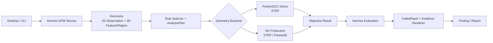
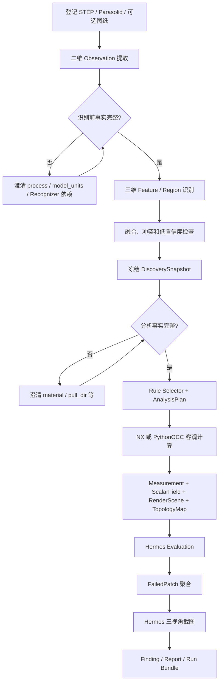

# DFM 架构、工作流与 NX 契约

本文是研发协作入口，说明模块边界、运行流程、NX 功能要求和关键数据映射。完整字段以
`tools/dfm/schemas/*.schema.json` 为准。

## 1. 架构边界



| 模块 | 负责 | 不负责 |
| --- | --- | --- |
| Hermes | 项目、事实、澄清、计划、规则、评价、截图、Finding、报告 | CAD 几何算法 |
| Recognizer | 识别 Feature/Region 及客观属性 | 阈值、pass/fail、建议 |
| Geometry Backend | 加载 CAD、拓扑/网格、客观 ScalarField/Measurement | 规则和截图策略 |
| NX Server | 上传、Job、许可证、Worker、取消、Artifact、安全隔离 | 业务规则 |
| NX Plugin | Loader、拓扑索引、Recognizer、白名单 Calculator | Hermes Manifest 和报告 |

PythonOCC 只用于 Demo 和生产契约回归；NX 是目标生产 Backend。两者复用相同 Objective
Task/Result、规则引擎、FailedPatch、截图和报告代码。

## 2. 运行工作流



两次事实门用途不同：第一次只确认会改变识别语义的事实；第二次确认规则和计算所需事实。
若将来倒扣 Recognizer 依赖 `pull_dir`，该事实会由 Recognizer 声明自动前移到第一道门。

当前没有真实工艺特征时，系统建立 `ordinary_part + whole_model`。启用真实特征后，每个
Feature Region 由特定 Face 集合定义，ordinary 变为这些 Face 的补集。Plan 按
`Feature × Region × Metric` 展开，保证特征区域和普通区域都计算且不重复。

## 3. 核心数据链

```text
InputRecord
→ Observation / FeatureRecord / RegionRecord
→ DiscoverySnapshotRecord
→ RuleBinding + PlanOperation
→ ObjectiveTaskRequest
→ Measurement + ScalarField
→ EvaluationRecord
→ FailedPatch
→ EvidenceRecord
→ FindingRecord / Report
```

关键关系：

| 对象 | 必须回链 |
| --- | --- |
| Region | Input SHA256；拓扑区域还要回链 TopologySnapshot/Entity |
| Operation | Feature、Region、Metric、Quantity、参数来源 |
| Measurement | Operation、Metric、Quantity、Feature、Region、Field、输入 |
| ScalarField | Operation、Scene、TopologyMap、两个 Snapshot、Sample/Cell |
| FailedPatch | Evaluation、Measurement、Field、Face、Triangle、范围和焦点 |
| Evidence | Patch、两个 Snapshot、相机、Renderer、图片 Artifact |
| Finding | Rule、Evaluation、Measurement、Feature、Region、Evidence |

## 4. 拓扑、网格和截图

Face 序号不能跨 CAD 内核或重新加载使用。正式身份是：

```json
{
  "kind": "face",
  "index": 17,
  "entity_id": "face_000017",
  "input_sha256": "...",
  "topology_snapshot_id": "topology_..."
}
```

`index` 只是快照内辅助编号。`TopologySnapshot` 记录 Backend、Loader、Indexer、实体数量和
拓扑内容哈希。`TopologyMap` 将每个 `entity_id` 映射到同一次离散化产生的 Triangle。

```json
{
  "render_mesh_snapshot_id": "mesh_...",
  "primitive_id": "body-1",
  "triangle_id": 108
}
```

`RenderMeshSnapshot` 记录所属 TopologySnapshot、离散参数、Triangle 数量和网格内容哈希。
重新加载拓扑或重新三角化会产生新 Snapshot，旧引用立即失效。

Hermes 不重新打开 CAD。它直接绘制 Backend 返回的 `RenderScene`，根据规则从 ScalarField
选出失败 Cell，合并为 FailedPatch，并高亮同一 Mesh Snapshot 的 Triangle。校验链为：

```text
Input SHA256
→ TopologySnapshot → GeometryRef(entity_id)
→ TopologyMap
→ RenderMeshSnapshot → TriangleRef
→ ScalarField Cell
→ Evaluation → FailedPatch
→ Hermes Renderer → Evidence
```

Run、输入、Scene、Map、Snapshot、内容哈希或 Entity/Triangle 映射不一致时必须失败，不得
按 Face 序号或坐标猜测后继续截图。

## 5. Objective 契约

当前唯一版本：

| 对象 | Schema |
| --- | --- |
| ObjectiveTask / ObjectiveResultManifest / NX Request / Capability | 4 |
| Measurement | 1 |
| ScalarField / RenderScene / TopologyMap | 2 |
| EvidenceGeometry / EvidenceRecord | 2 |

`ObjectiveTaskRequest` 包含 `run_id`、输入身份、process/scope、完整 Region 定义和 Operations。
Operation 使用稳定的 `calculator_id`，参数必须是已解析值并带 `source_ref`。请求中禁止出现
规则阈值、截图视角、严重程度或 Finding 策略。

成功结果必须包含一个 Measurement Artifact，并包含 Operation 声明的所有客观 Artifact。
每个 Artifact 都有 `artifact_id`、安全文件名、媒体类型、大小和 SHA256。Hermes 下载后再次
校验内容和对象间引用。

## 6. NX HTTP 与运行要求

### API

```text
GET  /v1/capabilities
POST /v1/inputs
PUT  /v1/inputs/{input_id}/content
POST /v1/jobs
GET  /v1/jobs/{job_id}
POST /v1/jobs/{job_id}/cancel
GET  /v1/jobs/{job_id}/result
GET  /v1/jobs/{job_id}/artifacts/{artifact_id}
```

模型先登记 SHA256、大小、文件名和 `format_id`，需要时再上传二进制；Job 通过 `input_id`
引用模型。Server 不接受客户端本地路径。`format_id` 当前为 `step | parasolid_xt`。

### NX Server

- 认证、限流、上传大小/格式/SHA256 校验；
- `run_id + input_sha256 + schema_version` 范围内幂等提交；
- Job 隔离目录、许可证调度、超时、取消和崩溃恢复；
- 每个 Job 使用受控 NX Session，崩溃 Session 不复用；
- Result 原子发布，Artifact 下载鉴权并校验大小和哈希；
- 多项目/租户存储和访问隔离，日志不泄露 Token、模型正文和客户路径。

### NX Plugin

- 分别实现并认证 STEP/Parasolid Loader，规范化单位和坐标语义；
- 产生稳定的 TopologySnapshot、Entity Identity Map、RenderMeshSnapshot 和 TopologyMap；
- 实现白名单 Recognizer 和 Calculator Registry；
- 当前第一批 Calculator：`load_geometry`、`inspect_topology`、
  `measure_wall_thickness`、`measure_draft`；
- 输出包含局部 Sample/Cell、GeometryRef 和 TriangleRef 的 ScalarField；
- 不返回 Evaluation、FailedPatch、截图、severity、rule 或 recommendation。

### Capability

每个 Calculator 分别声明状态、实现版本、参数、Quantity、Artifact、Region mode、输入格式、
NX 版本和认证报告哈希。NX 能打开某格式不代表该 Calculator 已在该格式上认证。Hermes 在
提交前检查，Server 在排队前复核，Plugin Registry 再执行白名单校验。

## 7. 错误、缓存和隔离

- NX 不可用、格式未认证或计算失败必须明确失败，禁止自动降级 PythonOCC；
- 公共错误归一为 `objective_task_invalid`、`objective_input_invalid`、
  `objective_backend_unavailable`、`objective_calculation_failed`、
  `objective_result_invalid`、`objective_artifact_invalid` 和 `run_cancelled`；
- 项目目录是本地一级隔离边界，Artifact 身份至少包含 Run；NX 侧还必须隔离租户和 Job；
- 客观缓存指纹包含输入、Backend/算法版本、Operation 参数、区域和依赖；
- 仅规则变化可复用 Measurement，但必须重做 Evaluation、Evidence、Finding 和报告；
- 输入、TopologySnapshot、RenderMeshSnapshot 或算法变化使相关客观缓存失效。

## 8. NX 交付验收

1. Hermes 与 NX 共用 `tests/fixtures/dfm/nx/task_contract_*.json`；
2. 所有请求、结果和 Artifact 通过正式 Schema，未知/缺失字段有负例；
3. 上传中断、哈希错误、重复提交、许可证耗尽、取消和 NX Crash 有真实集成测试；
4. 同源 STEP/Parasolid 在真实 NX 中执行当前 Calculator；
5. 两种格式都能被 Hermes 生成 Evaluation、FailedPatch、三视角截图和 Finding；
6. 跨 Run、跨输入、Topology/Mesh Snapshot 错配和错误 Entity/Triangle 映射必须被拒绝；
7. 数值按批准容差、区域按语义/重叠率验收，不要求不同格式逐采样点完全相同；
8. Fake Client 和静态 Fixture 只能证明协议，不能替代真实 NX 生产认证。

## 9. 代码与契约入口

- Schema：`tools/dfm/schemas/`
- Python 契约：`tools/dfm/contracts.py`
- 当前 Scope：`tools/dfm/scopes/injection/wall_draft.json`
- 特征目录：`tools/dfm/scopes/injection/feature_catalog.json`
- NX Client：`tools/dfm/backends/nx/`
- 结果校验：`tools/dfm/analyzers/objective_result.py`
- PythonOCC 场：`tools/dfm/geometry/step/field_export.py`
- Hermes 证据：`tools/dfm/evidence/field_engine.py`

开发阶段和优先级见 [DFM 开发路径](2026-07-13-dfm-hermes-agent-development-roadmap.md)。
